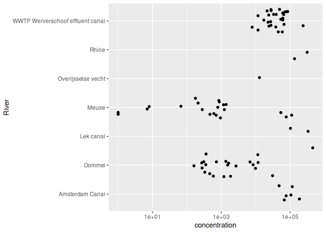
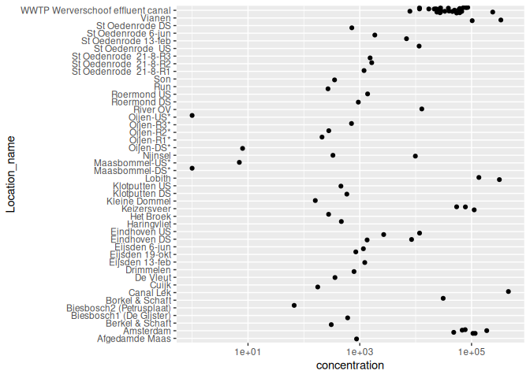

01_ParticleDataPrep
================

# About

The goal of this data preparation is to combine the particle data from
separate studies (Table 1) into three different tables/objects used in
further analysis. These are:

1.  particle_concentrations_total.Rds; This file contains a dataset with
    the total reported concentrations per sample. This also includes
    samples for which we do not have the raw LDIR or FTIR data. The
    concentrations of microplastics in \#/m^3 for each sample.

2.  particle_concentrations_per_polymer.Rds; This file contains a
    dataset with the reported concentrations per polymer per sample. The
    total reported concentrations are distributed over different
    polymers following the polymer distributions per sample calculated
    from the raw LDIR or FTIR data, depending on the data source. The
    concentrations of microplastics in \#/m^3 for each sample.

3.  Raw_FTIR_data.Rds contains all raw particle measurements from
    different data sources harmonized to one dataset.

*Table 1. Overview of Particle counting studies used in RIVM report
2026-0069*

| Citation | Link | Data Folder |
|----|----|----|
| ([Mintenig et al. 2020](#ref-mintenig2020)) | <https://doi.org/10.1016/j.watres.2020.115723> | [rawdata/Mintenig_2020](rawdata/Mintenig_2020/README.md) |
| ([Mughini-Gras et al. 2021](#ref-mughini-gras2021)) | <https://doi.org/10.1016/j.watres.2021.116852> | [rawdata/Mughini-Gras_2021](rawdata/Mughini-Gras_2021/README.md) |
| ([Bäuerlein et al. 2022](#ref-bäuerlein2022)) | <https://doi.org/10.1016/j.watres.2022.118790> | [rawdata/Bauerlein_2022](rawdata/Bauerlein_2022/README.md)[^1] |
| ([Bäuerlein et al. 2023](#ref-bäuerlein2023)) | <https://doi.org/10.2166/wst.2022.419> | [rawdata/Bauerlein_2023](rawdata/Bauerlein_2023/README.md)<sup>1</sup> |
| ([Mintenig et al. 2025](#ref-mintenig2025)) | No externally published report available | [rawdata/Mintenig_2025](rawdata/Mintenig_2025/README.md) |

These data are used in the next steps: 2. Fit a powerlaw to the longest
side data. 3. Calculate rescaled particle number concentrations for the
full 1 - 5000 µm size range.

# Read in data

The different studies (Table 1), using different methods, report
different measurements for particle size (Table 2). These are read in
and reworked to a harmonized shortest and longest size measurement.

*Table 2. Overview of column names for particle dimensions which are
harmonized to shortest and longest side.*

| Citation | Width | Height | Diameter | Minimum diameter |
|----|----|----|----|----|
| ([Mintenig et al. 2020](#ref-mintenig2020)) |  |  | x | x |
| ([Mughini-Gras et al. 2021](#ref-mughini-gras2021)) | x | x | x |  |
| ([Bäuerlein et al. 2022](#ref-bäuerlein2022)) | x | x | x |  |
| ([Bäuerlein et al. 2023](#ref-bäuerlein2023)) | x | x | x |  |
| ([Mintenig et al. 2025](#ref-mintenig2025)) |  |  | x | x |

The following steps are taken in preparing the raw FTIR data from above
sources for further analysis:

1.  Read in the data from Input_dir

2.  Combine the FTIR counting data with the metadata, often stored in a
    readme file together with the raw data

3.  Rename columns for further extraction of longest and shortest side
    later. Other columns are just added as is. For instance:

    - width_um = Width (µm)

    - height_um = Height (µm)

    - diameter_um = Diameter (µm)

    - area_um2 = Area (µm²)

4.  Create a Sample_ID per unique water (or other media) sample.

5.  Rework the different size and dimension measures to derive:

    - Longest and Shortest side in µm from size measures in Table 2.

    - Shape from circularity and aspect ratio. If these are not reported
      an elipsoid is assumed.

    - Volume and Surface area is calculated based on Shape. We consider
      shapes: sphere, elipsoid and fibre.

## Bäuerlein 2022

Samples were taken 15cm below the water surface. Two samples of 500
liters were taken per sampling event; one for LDIR analysis (detection
range 20-500 μm) and one for optical microscopy analysis (OM) (detection
range 50-5000 μm). Here only the LDIR data is included, making the
detection range 20-500 μm. Sampling was done using a pump and filters
with different sizes (see Table 1 in the article by Bäuerlein et al.
(2022)).

Four samples were analysed in parallel in combination with a negative
control sample (see quality control) to calculate the recovery rate.
Details on the study approach, sampling and detection are stored in the
`readme.xlsx` file in the folder with raw data.

Overall the Bäuerlein et al. (2022) data contains measurements in
surface water, groundwater and samples related to drinking water.

``` r
# Function for reading in raw data continued in folder accompanied by a readme file
fReadInData <- function(Data_Path, remove_xlsx_extension = TRUE) {

  MetaData <- readxl::read_excel(paste0(Data_Path,"/readme.xlsx"), sheet = "Meta")
  
  DPfiles <- list.files(path = Data_Path, pattern = "\\.xlsx$", full.names = TRUE)
  DPfiles <- DPfiles[-grep("readme", DPfiles)]
  
  KWR_data_dfs <- NULL
  
  for(XLfile in DPfiles){
    sheets <- readxl::excel_sheets(XLfile)
    
    for (XLsheet in sheets){
    datasheet <- readxl::read_excel(XLfile, sheet = XLsheet)
    datasheet <- datasheet |> 
      mutate(XLfile = XLfile,
             XLsheet = XLsheet)
    KWR_data_dfs <-  bind_rows(KWR_data_dfs,datasheet)
    }
  }
  
  # rework to get key: Filename from the file path
  if(remove_xlsx_extension == TRUE){
    KWR_data_dfs <-
    KWR_data_dfs |> mutate(
      Filename = str_remove_all(XLfile, paste0(Data_Path,"/"))
    ) |> 
    mutate(Filename = str_remove_all(Filename, ".xlsx"))
  } else {
    KWR_data_dfs <-
      KWR_data_dfs |> mutate(
        Filename = str_remove_all(XLfile, paste0(Data_Path,"/"))
    )
  }
  
  KWR_data_dfs <-
    left_join(KWR_data_dfs, MetaData)
  
  return(KWR_data_dfs)
}

Bauerlein_2022 <- fReadInData(Data_Path = paste0(Input_dir, "/Bauerlein 2022"), remove_xlsx_extension = TRUE)
```

### Rename columns and create sample id

``` r
Bauerlein_2022 <- Bauerlein_2022 |>
    rename(width_um = `Width (µm)`,
         height_um = `Height (µm)`,
         diameter_um = `Diameter (µm)`,
         area_um2 = `Area (µm²)`,
         perimeter_um = `Perimeter (µm)`,
         KWR_particle_ID = Id) |>
  mutate(
    Data_source_clean = Data_source |>
      str_remove_all("et al\\.") |>
      str_remove_all("\ 
") |>
      str_squish(),
    Data_source_clean = gsub("\\(|\\)", "", Data_source_clean),
    Data_source_clean = gsub(" ", "_", Data_source_clean),
    Sample_ID = paste0(Data_source_clean, "_", Sample_no)
  ) |>
    mutate(sampling_date = as.Date(sampling_date)) |>
  select(-Data_source_clean)
```

### Calculate average share of polymers

To divide the concentrations between polymers we will calculate the
average share of each polymer from the LDIR data.

``` r
# Create a named vector for mapping
polymer_map <- c(
  "Acrylates" = "Acryl",
  "Acrylonitrile Butadiene" = "ABS",
  "Polyurethane (PU)" = "PUR",
  "Polymethylmethacrylate (PMMA)" = "PMMA",
  "Polyacetal" = "Others",
  "Polyimide" = "Others",
  "Polysulfone" = "Others",
  "Polysulfones" = "Others",
  "GREEN PE" = "PE",
  "Polyethylene (PE)" = "PE",
  "Polyethylene Chlorinated" = "PE",
  "Polyethylene Terephthalate (PET)" = "PET",
  "Polyethylene Terephthalete (PET)" = "PET",
  "Ethylene Vinyl Acetate (EVA)" = "Others",
  "Polypropylene (PP)" = "PP",
  "Polystyrene (PS)" = "PS",
  "Isopreen" = "Other synthetic rubbers",
  "Polybutadiene" = "Other synthetic rubbers",
  "Rubber" = "Other synthetic rubbers",
  "Alkyd Varnish" = "Others",
  "Polyamide (PA)" = "PA",
  "Polycarbonate (PC)" = "PC",
  "Polyether" = "Others",
  "Polylactic acid (PLA)" = "Others",
  "Polytetrafluoroethylene (PTFE)" = "Others",
  "Polyvinyl alcohol" = "Others",
  "Polyvinylchloride (PVC)" = "PVC",
  "Silicone" = "Others"
)

# Hardcoding of polymer map is error prone, so introduce a check if above map is complete:
if (any(!c(Bauerlein_2022 |> distinct(Identification) |> pull() %in% names(polymer_map)))) stop("Polymer map not complete") else (message("Polymer map ok"))
```

    ## NULL

``` r
polymer_map_bauerlein_2022 <- data.frame(
  Polymer = names(polymer_map),
  Group = unname(polymer_map),
  stringsAsFactors = FALSE
)

openxlsx::write.xlsx(polymer_map_bauerlein_2022, paste0(output_dir, "Tables/Polymer_map_Bauerlein_2022.xlsx"))

# Add Polymer_name column to raw df based on polymer_map
Bauerlein_2022 <- Bauerlein_2022 |>
  mutate(Polymer_name = recode(Identification, !!!polymer_map))

# Calculate the number of particles per identification (polymer) and assign a polymer group to each polymer
Bauerlein_2022_identification_share <- Bauerlein_2022 |>
  group_by(Identification, Sample_ID) |>
  summarise(n_particles = n()) |>
  mutate(
    Polymer = recode(Identification, !!!polymer_map, .default = "Others")
)

# Calculate the number of polymers per polymer group
Bauerlein_2022_polymer_share <- Bauerlein_2022_identification_share |>
  group_by(Polymer, Sample_ID) |>
  summarise(n_particles = sum(n_particles))

# Calculate total number of particles
Bauerlein_2022_polymer_share_total <- Bauerlein_2022_polymer_share |>
  group_by(Sample_ID) |>
  summarise(total_particles = sum(n_particles))

# Calculate the share (percentage) of each polymer group compared to the total number of polymers
Bauerlein_2022_polymer_share <- Bauerlein_2022_polymer_share |>
  left_join(Bauerlein_2022_polymer_share_total) |>
  mutate(fraction_polymer_per_sample = n_particles / total_particles) |>
  select(Polymer, fraction_polymer_per_sample, Sample_ID)
```

### Concentrations

Read in reported surface water concentrations.

``` r
Bauerlein_2022_concentrations_reported <- Bauerlein_2022 |>
  select(Concentration, unit, Water_type, Lower_sampling_size_limit_um, Upper_sampling_size_limit_um, Analysis_method, Sampling_method, Sample_volume_L, Location_name, Sampling_site_information, Data_source, Filename, River, Sample_ID, Latitude, Longitude, sampling_date) |>
  distinct() |>
  rename(reported_concentration_per_m3 = Concentration) 
```

Divide concentrations over polymers

``` r
Bauerlein_2022_concentrations_reported_polymer_particle <- Bauerlein_2022_polymer_share |>
  left_join(Bauerlein_2022_concentrations_reported) |>
  mutate(concentration = round(fraction_polymer_per_sample*reported_concentration_per_m3)) |>
  select(-c(fraction_polymer_per_sample, reported_concentration_per_m3))

Bauerlein_2022_concentrations_reported_total_particle <- Bauerlein_2022_concentrations_reported |>
  rename(concentration = reported_concentration_per_m3) |>
  mutate(Polymer = "Total")
```

Count particles and calculate concentrations from LDIR data

``` r
Bauerlein_2022_concentrations_calculated <- Bauerlein_2022 |>
  group_by(unit, Water_type, Lower_sampling_size_limit_um, Upper_sampling_size_limit_um, 
           Analysis_method, Sampling_method, Sample_volume_L, Sampling_site_information, 
           Location_name, Data_source, Filename, River, Latitude, Longitude) |>
  summarise(particles = n(), .groups = "drop") |>
  mutate(
    Sample_volume_m3 = Sample_volume_L / 1000,
    calculated_concentration_per_m3 = particles / Sample_volume_m3
  )
```

Compare calculated and reported concentrations

``` r
Bauerlein_2022_concentration_comparison <- inner_join(
  Bauerlein_2022_concentrations_calculated,
  Bauerlein_2022_concentrations_reported) |>
  mutate(
    concentration_difference = calculated_concentration_per_m3 - reported_concentration_per_m3
  )
```

## Bäuerlein et al. (2023)

Samples were taken 15cm below the water surface. Two samples of 500
liters were taken per sampling event; one for LDIR analysis (detection
range 20-500 μm) and one for optical microscopy analysis (detection
range 50-5000 μm).

Here only the LDIR data is included, making the detection range 20-500
μm.

Furthermore one should consider that the data contains measurements in
effluent as well as measurements before and after a bubble curtain,
which is a microplastic filter. One should consider this in further
analysis.

``` r
Bauerlein_2023 <- fReadInData(Data_Path = paste0(Input_dir, "/Bauerlein 2023"), remove_xlsx_extension = FALSE)
```

``` r
Bauerlein_2023 <- Bauerlein_2023 |>
    rename(width_um = Width,
         height_um = Height,
         diameter_um = Diameter,
         area_um2 = Area,
         perimeter_um = Perimeter) |>
  mutate(
    Data_source_clean = Data_source |>
      str_remove_all("et al\\.") |>
      str_remove_all("\ 
") |>
      str_squish(),
    Data_source_clean = gsub("\\(|\\)", "", Data_source_clean),
    Data_source_clean = gsub(" ", "_", Data_source_clean),
    Sample_ID = paste0(Data_source_clean, "_", Sample_no)
  ) |>
  select(-Data_source_clean) |>
  separate(Filename, into = c("sampling_day", "sampling_month", "rest1", "rest2"), sep = "-", remove = FALSE) |>
  select(-c(rest1, rest2)) |>
  mutate(sampling_month = case_when(
    sampling_month == "Jul" ~ "07",
    sampling_month == "Aug" ~ "08",
    sampling_month =="Sept" ~ "09",
    sampling_month == "Oct" ~ "10",
    sampling_month == "Nov" ~ "11"
  )) |>
    mutate(sampling_month = str_pad(sampling_month, 2, pad = "0"),
    sampling_day = str_pad(sampling_day, 2, pad = "0"),
    sampling_date = paste0(sampling_day, "-", sampling_month, "-", sampling_year),
    sampling_date = as.Date(sampling_date, "%d-%m-%Y")
  ) |>
  select(-c(sampling_day, sampling_year, sampling_month))
```

### Calculate average share of polymers

To divide the concentrations between polymers we will calculate the
average share of each polymer from the LDIR data.

``` r
# Create a named vector for mapping
polymer_map <- c(
  "Polyurethane (PU)" = "PUR",
  "Polymethylmethacrylate (PMMA)" = "PMMA",
  "Acrylonitrile Butadiene" = "ABS",
  "Acrylates" = "Acryl",
  "Polyacetal" = "Others",
  "Polyimide" = "Others",
  "Polysulfone" = "Others",
  "Polysulfones" = "Others",
  "Polyethylene (PE)" = "PE",
  "Polyethylene Terephthalate (PET)" = "PET",
  "Polyethylene Terephthalete (PET)" = "PET",
  "Polyethylene Chlorinated" = "PE",
  "GREEN PE" = "PE",
  "Ethylene Vinyl Acetate (EVA)" = "Others",
  "Polypropylene (PP)" = "PP",
  "Polystyrene (PS)" = "PS",
  "Isopreen" = "Other synthetic rubbers",
  "Polybutadiene" = "Other synthetic rubbers",
  "Rubber" = "Other synthetic rubbers",
  "Polyisoprene Chlorinated" = "Other synthetic rubbers",
  "Polyamide (PA)" = "PA",
  "Polyvinylchloride (PVC)" = "PVC",
  "Unknown" = "Others",
  "KWR D9" = "Others",
  "Agilent A7" = "Others",
  "KWR B9" = "Others",
  "Particle Analysis A7" = "Others",
  "KWR B8" = "Others",
  "Agilent A9" = "Others",
  "KWR D4" = "Others",
  "KWR B7" = "Others",
  "KWR B10" = "Others",
  "Agilent A2" = "Others",
  "Polylactic acid (PLA)" = "Others",
  "Silicone" = "Others",
  "Polyvinyl alcohol" = "Others",
  "Alkyd Varnish" = "Others",
  "Polycarbonate (PC)" = "PC",
  "Polytetrafluoroethylene (PTFE)" = "Others",
  "Unidentified" = "Others",
  "Polycaprolactone" = "Others",
  "Polyether" = "Others"
)

if (any(!c(Bauerlein_2023 |> distinct(Identification) |> pull() %in% names(polymer_map)))) stop("Polymer map not complete") else (message("Polymer map ok"))
```

    ## NULL

``` r
if (any(!c(Bauerlein_2023 |> distinct(Identification) |> pull() %in% (names(polymer_map))))) {
  Ba23Mat <- Bauerlein_2023 |> distinct(Identification) |> pull()
Ba23NotPlast <- MintMat[!c(Bauerlein_2023 |> distinct(Identification) |> pull() %in% (names(polymer_map)))]
  warning("Materials ", paste(MintNotPlast,  collapse = "; "), " not included as Polymers")} else (message("Polymer map ok"))
```

    ## NULL

``` r
polymer_map_bauerlein_2023 <- data.frame(
  Polymer = names(polymer_map),
  Group = unname(polymer_map),
  stringsAsFactors = FALSE
)

openxlsx::write.xlsx(polymer_map_bauerlein_2023, paste0(output_dir, "Tables/Polymer_map_Bauerlein_2023.xlsx"))

# Add Polymer_name column to raw df based on polymer_map
Bauerlein_2023 <- Bauerlein_2023 |>
  mutate(Polymer_name = recode(Identification, !!!polymer_map))

# Calculate the number of particles per identification (polymer) and assign a polymer group to each polymer
Bauerlein_2023_identification_share <- Bauerlein_2023 |>
  group_by(Identification, Sample_ID) |>
  summarise(n_particles = n()) |>
  mutate(
    Polymer = recode(Identification, !!!polymer_map, .default = "Others")
)

# Calculate the number of polymers per polymer group
Bauerlein_2023_polymer_share <- Bauerlein_2023_identification_share |>
  group_by(Polymer, Sample_ID) |>
  summarise(n_particles = sum(n_particles))

# Calculate total number of particles
Bauerlein_2023_polymer_share_total <- Bauerlein_2023_polymer_share |>
  group_by(Sample_ID) |>
  summarise(total_particles = sum(n_particles))

# Calculate the share (percentage) of each polymer group compared to the total number of polymers
Bauerlein_2023_polymer_share <- Bauerlein_2023_polymer_share |>
  left_join(Bauerlein_2023_polymer_share_total) |>
  mutate(fraction_polymer_per_sample = n_particles / total_particles) |>
  select(Polymer, fraction_polymer_per_sample, Sample_ID)
```

### Concentrations

Read in reported surface water concentrations.

``` r
Bauerlein_2023_concentrations_reported <- Bauerlein_2023 |>
  select(Concentration, unit, Water_type, Lower_sampling_size_limit_um, Upper_sampling_size_limit_um, Analysis_method, Sampling_method, Sample_volume_L, Location_name, Sampling_site_information, Data_source, Filename, River, Sample_ID, Latitude, Longitude, sampling_date) |>
  distinct() |>
  rename(reported_concentration_per_m3 = Concentration)
```

Divide concentrations over polymers

``` r
Bauerlein_2023_concentrations_reported_polymer_particle <- Bauerlein_2023_polymer_share |>
  left_join(Bauerlein_2023_concentrations_reported) |>
  mutate(concentration = round(fraction_polymer_per_sample*reported_concentration_per_m3)) |>
  select(-c(fraction_polymer_per_sample, reported_concentration_per_m3))

Bauerlein_2023_concentrations_reported_total_particle <- Bauerlein_2023_concentrations_reported |>
  rename(concentration = reported_concentration_per_m3) |>
  mutate(Polymer = "Total")
```

Calculate concentrations

``` r
Bauerlein_2023_concentrations <- Bauerlein_2023 |>
  select(Concentration, unit, Water_type, Lower_sampling_size_limit_um, Upper_sampling_size_limit_um, Analysis_method, Sampling_method, Sample_volume_L, Location_name, Sampling_site_information, Data_source, River, Filename, Latitude, Longitude) |>
  distinct()

Bauerlein_2023_concentrations_calculated <- Bauerlein_2023 |>
  filter(!is.na(Sample_volume_L) & Sample_volume_L > 0) |>
  group_by(unit, Water_type, Lower_sampling_size_limit_um, Upper_sampling_size_limit_um, 
           Analysis_method, Sampling_method, Sample_volume_L, Sampling_site_information, 
           Location_name, Data_source, Filename, River, Latitude, Longitude) |>
  summarise(particles = n(), .groups = "drop") |>
  mutate(
    Sample_volume_m3 = Sample_volume_L / 1000,
    calculated_concentration_per_m3 = particles / Sample_volume_m3
  )
```

Compare calculated and reported concentrations

``` r
Bauerlein_2023_concentration_comparison <- inner_join(
  Bauerlein_2023_concentrations_calculated,
  Bauerlein_2023_concentrations_reported
) |>
  mutate(
    concentration_difference = calculated_concentration_per_m3 - reported_concentration_per_m3
  )
```

## Mughini-Gras et al. (2021)

``` r
Mughini_Gras_2021 <- fReadInData(Data_Path = paste0(Input_dir, "/Mughini-Gras_2021"), remove_xlsx_extension = TRUE) |>
  filter(MaxAds > 0.05) |> # Op aanraden van Patrick Bauerlein: maximale IR-adsorptie. Ik stel voor dat je alle regels met een waarde onder 0,05 gaat weggooien want dan is het IR-spectrum voornamelijk baseline. 
  mutate(sampling_date = as.Date(sampling_date)) |>
  filter(!Identification %in% c("Cellulosic", "Silica")) # Remove non-plastic particles from dataset
```

### Rename columns and create sample id

``` r
Mughini_Gras_2021 <- Mughini_Gras_2021 |>
    rename(width_um = `Width`,
         height_um = `Height`,
         diameter_um = `Diameter`,
         area_um2 = `Area`,
         perimeter_um = `Perimeter`,
         KWR_particle_ID = Id) |>
  mutate(
    Data_source_clean = Data_source |>
      str_remove_all("et al\\.") |>
      str_remove_all("\ 
") |>
      str_squish(),
    Data_source_clean = gsub("\\(|\\)", "", Data_source_clean),
    Data_source_clean = gsub(" ", "_", Data_source_clean),
    Sample_ID = paste0(Data_source_clean, "_", Sample_no)
  ) |>
  select(-Data_source_clean)
```

### Concentrations

``` r
Sampling_IDs <- Mughini_Gras_2021 |>
  select(Sample_ID, Sample_no) |>
  distinct()

MetaData <- Mughini_Gras_2021 |>
    select(Water_type, Lower_sampling_size_limit_um, Upper_sampling_size_limit_um, Analysis_method, Sampling_method, Sample_volume_L, Location_name, Data_source, Filename, River, Sample_ID, Latitude, Longitude, sampling_date, Sample_no) |>
  distinct() 

Mughini_Gras_2021_concentrations_reported <- openxlsx::read.xlsx(paste0(Input_dir, "/Mughini-Gras_2021/readme.xlsx"), sheet = "Concentrations") |>
  pivot_longer(cols = !c("unit", "Sample_no"), names_to = "Polymer", values_to = "concentration") |>
  left_join(MetaData) 
  
Mughini_Gras_2021_concentrations_reported_total <- Mughini_Gras_2021_concentrations_reported |>
  filter(Polymer == "Total") 
```

``` r
# Create a named vector for mapping
polymer_map <- c(
  "Polyurethane (PU)" = "PUR",
  "Polyethylene (PE)" = "PE",
  "Polyethylene Terephthalate (PET)" = "PET", 
  "Polyethylene Terephthalete (PET)" = "PET", 
  "Polypropylene (PP)" = "PP",
  "Polystyrene (PS)" = "PS",
  "Isopreen" = "Other synthetic rubbers",
  "Polyamide (PA)" = "PA",
  "Unknown" = "Others",
  "Polyvinylchloride (PVC)" = "PVC"
)

if (any(!c(Mughini_Gras_2021 |> distinct(Identification) |> pull() %in% names(polymer_map)))) stop("Polymer map not complete") else (message("Polymer map ok"))
```

    ## NULL

``` r
polymer_map_Mughini_Gras_2021 <- data.frame(
  Polymer = names(polymer_map),
  Group = unname(polymer_map),
  stringsAsFactors = FALSE
)

openxlsx::write.xlsx(polymer_map_Mughini_Gras_2021, paste0(output_dir, "Tables/Polymer_map_Mughini_Gras_2021.xlsx"))

# Add Polymer_name column to raw df based on polymer_map
Mughini_Gras_2021 <- Mughini_Gras_2021 |>
  mutate(Polymer_name = recode(Identification, !!!polymer_map))

# Calculate the number of particles per identification (polymer) and assign a polymer group to each polymer
Mughini_Gras_2021_identification_share <- Mughini_Gras_2021 |>
  group_by(Identification, Sample_ID, Sample_no) |>
  summarise(n_particles = n()) |>
  mutate(
    Polymer = recode(Identification, !!!polymer_map, .default = "Others")
)

#Code below is because the concentrations are averages between two samples each
Mughini_Gras_2021_polymer_share <- Mughini_Gras_2021_identification_share %>%
  mutate(Sample_ID = case_when(
    Sample_ID %in% c("Mughini-Gras_2021_1", "Mughini-Gras_2021_3") ~ "Mughini-Gras_2021_1",
    Sample_ID %in% c("Mughini-Gras_2021_2", "Mughini-Gras_2021_4") ~ "Mughini-Gras_2021_2",
    Sample_ID %in% c("Mughini-Gras_2021_5", "Mughini-Gras_2021_7") ~ "Mughini-Gras_2021_5",
    Sample_ID %in% c("Mughini-Gras_2021_6", "Mughini-Gras_2021_8") ~ "Mughini-Gras_2021_6",
  )) |>
  group_by(Polymer, Sample_ID) |>
  summarise(n_particles = sum(n_particles), .groups = "drop") 

# Calculate total number of particles
Mughini_Gras_2021_polymer_share_total <- Mughini_Gras_2021_polymer_share |>
  group_by(Sample_ID) |>
  summarise(total_particles = sum(n_particles))

# Calculate the share (percentage) of each polymer group compared to the total number of polymers
Mughini_Gras_2021_polymer_share <- Mughini_Gras_2021_polymer_share |>
  left_join(Mughini_Gras_2021_polymer_share_total) |>
  mutate(fraction_polymer_per_sample = n_particles / total_particles) |>
  select(Polymer, fraction_polymer_per_sample, Sample_ID)

Mughini_Gras_2021_concentrations_reported_polymer_particle <- Mughini_Gras_2021_polymer_share |>
  left_join(Mughini_Gras_2021_concentrations_reported_total |> select(-Polymer)) |>
  mutate(concentration = round(fraction_polymer_per_sample*concentration)) |>
  select(-c(fraction_polymer_per_sample))
```

## Mintenig et al. (2020)

Mintenig et al. (2020) collected samples in the Meuse and Dommel and
their tributaries. The sample volume differs per sample and is reported
in the dataset. A centrifugal water pump was used to collect water,
which was poured over stacked sieves with 300 μm, 100 μm and 20 μm mesh
sizes. Particles smaller than 300 μm were analyzed using Micro-FTIR and
particles larger than 300 μm were analyzed with ATR_FTIR.

``` r
Mintenig_2020 <- openxlsx::read.xlsx(paste0(Input_dir, "/Mintenig_2020/Mintenig_2020_SurfaceWater.xlsx")) |>
  filter(water_type != "blank") |> # Remove the blanks from the dataset
  select(-Sample_volume_m3) |> # Also present in metadata, so joined later in this chunk
  select(-date) # because date is present in the metadata
  
MetaData <- openxlsx::read.xlsx(paste0(Input_dir, "/Mintenig_2020/readme.xlsx"), sheet = "Meta") |>
  mutate(sampling_date = as.Date(date, origin = "1899-12-30")) |>
  select(-date) # Remove the original date, because it is not formatted correctly

Mintenig_2020 <- Mintenig_2020 |>
  left_join(MetaData) |>
  mutate(Sample_volume_L = Sample_volume_m3*1000)

Mintenig_2020 |> as_tibble() |> distinct(Data_source) 
```

    ## # A tibble: 1 × 1
    ##   Data_source           
    ##   <chr>                 
    ## 1 Mintenig et al. (2020)

``` r
Mintenig_2020 <- Mintenig_2020 |>
  rename(min_diameter_um = min.diameter,
         diameter_um = diameter,
         area_um2 = area,
         volume_um3 = volume,
         particle_type = ParticleType) |>
  mutate(
    longest_side_um = case_when(
      diameter_um > min_diameter_um ~ diameter_um,
      TRUE ~ min_diameter_um
    ),
    shortest_side_um = case_when(
      diameter_um < min_diameter_um ~ diameter_um,
      TRUE ~ min_diameter_um
    )
  ) |>
  mutate(
    Data_source_clean = Data_source |>
      str_remove_all("et al\\.") |>
      str_remove_all("\ 
") |>
      str_squish(),
    Data_source_clean = gsub("\\(|\\)", "", Data_source_clean),
    Data_source_clean = gsub(" ", "_", Data_source_clean),
    Sample_ID = paste0(Data_source_clean, "_", Sample_no)
  ) |>
  select(-c(Data_source_clean, Sample_no))
```

Not all particles in the dataset are polymers. Below we remove the
non-polymer particles from the dataset. And rename some columns for
clarity.

``` r
unique(Mintenig_2020$material)
```

    ##  [1] "cellulose.plant fibres"          "polychloroprene"                
    ##  [3] "chitin"                          "polycaprolactone"               
    ##  [5] "ethylene-vinyl-acetate"          "coal"                           
    ##  [7] "rubber type 3"                   "polyethylene"                   
    ##  [9] "polyethylene. chlorinated"       "polypropylene"                  
    ## [11] "polyamide"                       "nitrile rubber"                 
    ## [13] "acrylates.polyurethanes.varnish" "animal furs.natural polyamides" 
    ## [15] "polycarbonate"                   "Cellulose artfical modified"    
    ## [17] "polystyrene"                     "quartz"                         
    ## [19] "charcoal"                        "polyester"                      
    ## [21] "acrylonitrile-butadiene"         "polyvinylchloride"              
    ## [23] "polyimide"                       "rubber type 2"                  
    ## [25] "polysulfone"                     "polyetyhlene oxidized"          
    ## [27] "rubber type 1"                   "polyoxymethylene"               
    ## [29] "polyetheretherketone"            "polyphenylene ether"            
    ## [31] "polytetrafluoroethylene"         "Cellophane"

``` r
# Define materials that are polymers
polymer_map <- c("polychloroprene" = "Others", 
                       "polycaprolactone" = "Others",
                       "ethylene-vinyl-acetate" = "Others", 
                       "rubber type 3" = "EPDM", 
                       "polyethylene" = "PE", 
                       "polyethylene. chlorinated" = "PE",
                       "polypropylene" = "PP", 
                       "polyamide" = "PA", 
                       "nitrile rubber" = "Other synthetic rubbers",
                       "acrylates.polyurethanes.varnish" = "Acryl", 
                       "polycarbonate" = "Others",
                       "polystyrene" = "PS", 
                       "polyester" = "PET", 
                       "acrylonitrile-butadiene" = "ABS",
                       "polyvinylchloride" = "PVC", 
                       "polyimide" = "Others", 
                       "rubber type 2" = "NR",
                       "polysulfone" = "Others", 
                       "polyetyhlene oxidized" = "PE", 
                       "rubber type 1" = "SBR",
                       "polyoxymethylene" = "Others", 
                       "polyetheretherketone" = "Others", 
                       "polyphenylene ether" = "Others",
                       "polytetrafluoroethylene" = "Others" 
                       )

polymer_map_Mintenig_2020 <- data.frame(
  Polymer = names(polymer_map),
  Group = unname(polymer_map),
  stringsAsFactors = FALSE
)

Mintenig_2020 <- Mintenig_2020 |>
  filter(material %in% polymer_map_Mintenig_2020$Polymer)

if (any(!c(Mintenig_2020 |> distinct(material) |> pull() %in% names(polymer_map)))) stop("Polymer map not complete") else (message("Polymer map ok"))
```

    ## NULL

``` r
if (any(!c(Mintenig_2020 |> distinct(material) |> pull() %in% (names(polymer_map))))) {
  Ba23Mat <- Mintenig_2020 |> distinct(material) |> pull()
Ba23NotPlast <- MintMat[!c(Mintenig_2020 |> distinct(material) |> pull() %in% (names(polymer_map)))]
  warning("Materials ", paste(MintNotPlast,  collapse = "; "), " not included as Polymers")} else (message("Polymer map ok"))
```

    ## NULL

``` r
openxlsx::write.xlsx(polymer_map_Mintenig_2020, paste0(output_dir, "Tables/Polymer_map_Mintenig_2020.xlsx"))

# Add Polymer_name column to raw df based on polymer_map
Mintenig_2020 <- Mintenig_2020 |>
  mutate(Polymer_name = recode(material, !!!polymer_map))

# Calculate the number of particles per material (polymer) and assign a polymer group to each polymer
Mintenig_2020_material_share <- Mintenig_2020 |>
  group_by(material, Sample_ID) |>
  summarise(n_particles = n()) |>
  mutate(
    Polymer = recode(material, !!!polymer_map, .default = "Others")
)

# Calculate the number of polymers per polymer group
Mintenig_2020_polymer_share <- Mintenig_2020_material_share |>
  group_by(Polymer, Sample_ID) |>
  summarise(n_particles = sum(n_particles))

# Calculate total number of particles
Mintenig_2020_polymer_share_total <- Mintenig_2020_polymer_share |>
  group_by(Sample_ID) |>
  summarise(total_particles = sum(n_particles))

# Calculate the share (percentage) of each polymer group compared to the total number of polymers
Mintenig_2020_polymer_share <- Mintenig_2020_polymer_share |>
  left_join(Mintenig_2020_polymer_share_total) |>
  mutate(fraction_polymer_per_sample = n_particles / total_particles) |>
  select(Polymer, fraction_polymer_per_sample, Sample_ID)
```

### Concentrations

``` r
Mintenig_2020_concentrations_calculated <- Mintenig_2020 |>
  group_by(Location_name, Sample_volume_L, Sampling_site_information, Sample_ID, Latitude, Longitude) |>
  summarise(particles = n()) |>
  mutate(particles_per_m3 = (particles/Sample_volume_L)*1000) |>
  ungroup() |>
  group_by(Location_name, Sampling_site_information,, Sample_ID) |>
  summarise(Concentration = round(sum(particles_per_m3))) |>
  mutate(unit = "#/m3") |>
  ungroup() |>
  left_join(MetaData, join_by("Location_name")) |>
    mutate(
    Data_source_clean = Data_source |>
      str_remove_all("et al\\.") |>
      str_remove_all("\ 
") |>
      str_squish(),
    Data_source_clean = gsub("\\(|\\)", "", Data_source_clean),
    Data_source_clean = gsub(" ", "_", Data_source_clean),
    Sample_ID = paste0(Data_source_clean, "_", Sample_no)
  ) |>
  select(-c(Data_source_clean, Sample_no))
```

Read in reported concentrations

``` r
MetaData <- MetaData |>
  mutate(Sample_volume_L = Sample_volume_m3*1000) |>
    mutate(
    Data_source_clean = Data_source |>
      str_remove_all("et al\\.") |>
      str_remove_all("\ 
") |>
      str_squish(),
    Data_source_clean = gsub("\\(|\\)", "", Data_source_clean),
    Data_source_clean = gsub(" ", "_", Data_source_clean),
    Sample_ID = paste0(Data_source_clean, "_", Sample_no)
  ) |>
  select(-c(Data_source_clean, Sample_no))

Mintenig_2020_concentrations_reported <- openxlsx::read.xlsx(paste0(Input_dir, "/Mintenig_2020/Mintenig_2020_reported_concentrations_from_paper_SI.xlsx"), sheet = "All") |>
  pivot_longer(names_to = "pol_unit", values_to = "concentration", cols=!c("Location_name")) |>
  separate(pol_unit, into = c("Polymer", "unit"), sep = "_") |>
  left_join(MetaData)

Mintenig_2020_concentrations_reported_total_particle <- Mintenig_2020_concentrations_reported |>
  filter(unit == "#/m3") |>
  filter(Polymer == "Total")
```

Divide concentrations over polymers

``` r
Mintenig_2020_concentrations_reported_polymer_particle <- Mintenig_2020_polymer_share |>
  left_join(Mintenig_2020_concentrations_reported_total_particle |> select(-Polymer), by = "Sample_ID") |>
  mutate(concentration = round(fraction_polymer_per_sample*concentration)) |>
  select(-fraction_polymer_per_sample)
```

## Mintenig et al. (2025)

Mintenig et al. (2025) collected samples in the Dommel at four different
locations. The sample volume differs per sample and is reported in the
dataset. A centrifugal water pump was used to collect water, which was
poured over stacked sieves with 500 μm, 100 μm and 20 μm mesh sizes. A
planktonnet with a 500 μm mesh size was also used for collection of
larger microplastics. Particles smaller than 500 μm were analyzed using
Micro-FTIR and particles larger than 500 μm were analyzed with ATR_FTIR.

``` r
Mintenig_2025 <- read.csv(paste0(Input_dir, "/Mintenig_2025/MP_Dommel_WUR_2025.csv")) |>
  rename(Filename = location,
         Sample_volume_L = sample_volume)

MetaData <- openxlsx::read.xlsx(paste0(Input_dir, "/Mintenig_2025/readme.xlsx")) |>
     mutate(sampling_date = as.Date(date, origin = "1899-12-30")) |>
  select(-date) 

Mintenig_2025 <- Mintenig_2025 |>
  filter(!is.na(sampletype)) |>
  select(-Sample_volume_L) |> # This is the sample volume per filter, total sample filter is added when joining the metadata
  mutate(Filename = case_when(
    str_detect(FTIR_analysed_filter, "BS") ~ "BS",
    str_detect(FTIR_analysed_filter, "EDS") ~ "EDS",
    str_detect(FTIR_analysed_filter, "EUS") ~ "EUS",
    str_detect(FTIR_analysed_filter, "N") ~ "N",
    TRUE ~ NA_character_  
  )) |>
  left_join(MetaData, by = "Filename") |>
  mutate(
    Data_source_clean = Data_source |>
      str_remove_all("et al\\.") |>
      str_remove_all("\ 
") |>
      str_squish(),
    Data_source_clean = gsub("\\(|\\)", "", Data_source_clean),
    Data_source_clean = gsub(" ", "_", Data_source_clean),
    Sample_ID = paste0(Data_source_clean, "_", Sample_no)
  ) |>
  select(-Data_source_clean)
```

Rename columns to match the other datasets

``` r
Mintenig_2025 <- Mintenig_2025 |>
  rename(width_um = width,
         length_um = length,
         area_um2 = area,
         volume_um3 = volume) |>
    mutate(
    longest_side_um = case_when(
      width_um > length_um ~ width_um,
      TRUE ~ length_um
    ),
    shortest_side_um = case_when(
      width_um < length_um ~ width_um,
      TRUE ~ length_um
    )
  ) |>
  filter(!is.na(volume_um3))
```

### Concentrations

Add sample ID to metadata

``` r
sample_ids <- Mintenig_2025 |>
  select(Location_name, Sample_ID) |>
  distinct()

MetaData <- MetaData |>
  left_join(sample_ids)
```

Calculate number surface water microplastic concentrations based on
sample volume.

``` r
Mintenig_2025_calculated_concentrations <- Mintenig_2025 |>
  group_by(Location_name, Sample_volume_L) |>
  summarise(particles = n()) |>
  mutate(particles_per_m3 = (particles/Sample_volume_L)*1000) |>
  group_by(Location_name) |>
  summarise(Concentration = sum(particles_per_m3)) |>
  mutate(unit = "#/m3") |>
  left_join(MetaData) |>
  mutate(Polymer = "Total")
```

Read in reported microplastic surface water concentrations with
calculation described in Mintenig (2025), Figure 5 in that report.

``` r
Mintenig_2025_concentrations_reported_polymer_particle <- openxlsx::read.xlsx(paste0(Input_dir, "/Mintenig_2025/Concentrations.xlsx")) |>
  select(Location_name, Polymer, concentration, unit) |>
  left_join(MetaData) 

Mintenig_2025_concentrations_reported_polymer_total <- openxlsx::read.xlsx(paste0(Input_dir, "/Mintenig_2025/Concentrations.xlsx")) |>
  select(Location_name, Polymer, concentration, unit) |>
  group_by(Location_name, unit) |>
  summarise(concentration = sum(concentration)) |>
  inner_join(MetaData) |>
  mutate(Polymer = "Total")
```

Group polymers

``` r
# Create a named vector for mapping
polymer_map <- c(
  "polyethylene"                     = "PE",
  "polyetyhlene oxidized"            = "PE",
  "polyethylene, chlorinated"        = "PE",
  "polypropylene"                    = "PP",
  "polystyrene"                      = "PS",
  "polycarbonate"                    = "Others",
  "polyamide"                        = "PA",
  "polyvinylchloride"                = "PVC",
  "Cellulose artfical modified"      = "Others",
  "nitrile rubber"                   = "Other synthetic rubbers",
  "polyester"                        = "PET",
  "acrylates,polyurethanes,varnish"  = "Acryl",
  "polychloroprene"                  = "Other synthetic rubbers",
  "polycaprolactone"                 = "Others",
  "ethylene-vinyl-acetate"           = "Others",
  "acrylonitrile-butadiene"          = "ABS",
  "rubber type 1"                    = "SBR",
  "rubber type 3"                    = "EPDM"
)

polymer_map_mintenig_2025 <- data.frame(
  Polymer = names(polymer_map),
  Group = unname(polymer_map),
  stringsAsFactors = FALSE
)

if (any(!c(Mintenig_2025_concentrations_reported_polymer_particle |> distinct(Polymer) |> pull() %in% names(polymer_map)))) stop("Polymer map not complete") else (message("Polymer map ok"))
```

    ## NULL

``` r
if (any(!c(Mintenig_2025 |> distinct(polymer_name) |> pull() %in% names(polymer_map)))) stop("Polymer map not complete") else (message("Polymer map ok"))
```

    ## NULL

``` r
openxlsx::write.xlsx(polymer_map_mintenig_2025, paste0(output_dir, "/Tables/Polymer_map_Mintenig_2025.xlsx"))

# Add Polymer_name column to raw df based on polymer_map
Mintenig_2025 <- Mintenig_2025 |>
  mutate(Polymer_name = recode(polymer_name, !!!polymer_map))

Mintenig_2025_concentrations_reported_polymer_particle <- Mintenig_2025_concentrations_reported_polymer_particle |>
  mutate(
    Polymer = recode(Polymer, !!!polymer_map, .default = "Others")
) |>
  group_by(across(-c(concentration))) |>
  summarise(concentration = sum(concentration))
```

## Leslie et al. (2017)

Leslie et al. (2017) measured the microplastic concentration in canals
in Amsterdam and WWTP influent/effluent at several locations in the
Netherlands. Samples were collected in Samples were collected in 1 or 2
liter glass jars. Particles were detected using light microscopy and the
detection limit is 10 - 5000 μm.

Influent samples were excluded.

``` r
Leslie_2017 <- openxlsx::read.xlsx(paste0(Input_dir, "/Leslie_2017/Reported_concentrations.xlsx")) |>
  mutate(
    Data_source_clean = Data_source |>
      str_remove_all("et al\\.") |>
      str_remove_all("\ 
") |>
      str_squish(),
    Data_source_clean = gsub("\\(|\\)", "", Data_source_clean),
    Data_source_clean = gsub(" ", "_", Data_source_clean),
    Sample_ID = paste0(Data_source_clean, "_", Sample_no)
  ) |>
  select(-c(Data_source_clean, Sample_no)) |>
  mutate(Polymer = "Total") |> 
  mutate(River = paste(Location_name,Sampling_site_information))
```

# Combine and harmonise

``` r
raw_ftir_data <- bind_rows(Bauerlein_2022, Bauerlein_2023, Mintenig_2020, Mintenig_2025, Mughini_Gras_2021)

unique(Mintenig_2020$Data_source)
```

    ## [1] "Mintenig et al. (2020)"

## Longest & shortest side

To fit the powerlaw all raw FTIR measurements need a variable
‘longest_side_um’ and ‘shortest_side_um’. In the chunk below checks are
performed if these variables exist, and if not the variables are
calculated.

``` r
Data_sources <- unique(raw_ftir_data$Data_source)

## Bauerlein 2022 has no shortest and longest side
raw_ftir_data |>
  filter(Data_source == Data_sources[1])|>
  distinct(longest_side_um)
```

    ## # A tibble: 1 × 1
    ##   longest_side_um
    ##             <dbl>
    ## 1              NA

``` r
## Bauerlein 2023 has no shortest and longest side
raw_ftir_data |>
  filter(Data_source == Data_sources[2])|>
  distinct(longest_side_um)
```

    ## # A tibble: 1 × 1
    ##   longest_side_um
    ##             <dbl>
    ## 1              NA

``` r
#### Mintenig datasets do have shortest and longest side.
raw_ftir_data|>
  filter(Data_source == Data_sources[3])|>
  distinct(longest_side_um)
```

    ## # A tibble: 748 × 1
    ##    longest_side_um
    ##              <dbl>
    ##  1             30 
    ##  2            351.
    ##  3            192.
    ##  4            234.
    ##  5            134.
    ##  6            120 
    ##  7            162.
    ##  8            127.
    ##  9            124.
    ## 10            108.
    ## # ℹ 738 more rows

``` r
raw_ftir_data |>
  filter(Data_source == Data_sources[4])|>
  distinct(longest_side_um)
```

    ## # A tibble: 787 × 1
    ##    longest_side_um
    ##              <dbl>
    ##  1             5.5
    ##  2            47.3
    ##  3            41.9
    ##  4            49.5
    ##  5            43.0
    ##  6            52.2
    ##  7            40.0
    ##  8            34.8
    ##  9            33.5
    ## 10            27.5
    ## # ℹ 777 more rows

``` r
#### Convert Bauerlein and Mughini-Gras width and height to shortest and longest side
raw_ftir_data <- raw_ftir_data |>
  mutate(longest_side_um = case_when(Data_source %in% Data_sources[c(1,2,5)] ~
                                       case_when(width_um>height_um ~ width_um,
                                                 TRUE~height_um),
                                     TRUE~longest_side_um))|>
  mutate(shortest_side_um = case_when(Data_source %in% Data_sources[c(1,2,5)]~
                                        case_when(width_um>height_um~ height_um,
                                                  TRUE~ width_um),
                                      TRUE~shortest_side_um))
```

## Shape

Derive shape from available data

``` r
raw_ftir_data |> select(shape) |> distinct()
```

    ## # A tibble: 3 × 1
    ##   shape   
    ##   <chr>   
    ## 1 <NA>    
    ## 2 particle
    ## 3 fiber

``` r
# here shape column is overwritten using an interpretation of two variables.
raw_ftir_data |>  filter(is.na(Circularity) & is.na("Aspect Ratio"))
```

    ## # A tibble: 0 × 67
    ## # ℹ 67 variables: KWR_particle_ID <chr>, width_um <dbl>, height_um <dbl>,
    ## #   diameter_um <dbl>, Aspect Ratio <dbl>, area_um2 <dbl>, perimeter_um <dbl>,
    ## #   Eccentricity <dbl>, Circularity <dbl>, Solidity <dbl>,
    ## #   Identification <chr>, Quality <dbl>, XLfile <chr>, XLsheet <chr>,
    ## #   Match Type <chr>, MaxAds <dbl>, Filename <chr>, Concentration <dbl>,
    ## #   Water_type <chr>, Lower_sampling_size_limit_um <dbl>,
    ## #   Upper_sampling_size_limit_um <dbl>, Analysis_method <chr>, …

``` r
# However most of these are NA and thus set to ellips.

raw_ftir_data <- raw_ftir_data |>
  mutate(shape = case_when(
    Circularity > 0.95 ~ "sphere", # circularity close to 1 indicates the particle is a sphere
    `Aspect Ratio` > 3 ~ "fiber", # ECHA definition of fiber
    TRUE ~ "ellips" # else assume the particle is an ellips
  ))
```

## Volume

We calculate volume for spheres, fibers, and ellipsoids using the
following formulas:

**Sphere:** Volume = (4/3) × π × r³ where

- r = longest_side_um / 2

**Fiber (Cylinder):** Volume = π × r² × length where

- r = shortest_side_um / 2
- length = longest_side_um

**Ellipsoid:** Volume = (4/3) × π × a × b × c where

- a = longest_side_um / 2
- b = shortest_side_um / 2
- c = shortest_side_um / 2 × 0.7

``` r
source("./R/Geometry.R")

raw_ftir_data <- raw_ftir_data |>
  mutate(volumeCalculated = case_when(
    shape == "sphere" ~ (longest_side_um/2)^3 * 4/3 * pi,
    shape == "fiber" ~ (shortest_side_um/2)^2 * pi * longest_side_um,
    TRUE ~ (longest_side_um/2 * shortest_side_um/2 * shortest_side_um/2 * 0.7)*4/3*pi
  ))
```

## Surface area

We calculate surface area for spheres, fibers, and ellipsoids using the
following formulas:

**Sphere:** Surface area = 4 × π × r² where r = longest_side_um / 2

**Fiber (Cylinder):** Surface area = 2 × π × r × (r + length) where

- r = shortest_side_um / 2
- length = longest_side_um

**Ellipsoid:** Surface area is approximated using the function
`Surface.ellipsoid(a, b, c, n)`, where:

- a = longest_side_um / 2
- b = shortest_side_um / 2
- c = shortest_side_um / 2 × 0.7
- n = 1.6 (precision parameter for the approximation)

``` r
raw_ftir_data<-raw_ftir_data |>
mutate(surfaceCalculated = case_when(
  shape == "sphere" ~ (longest_side_um/2)^2 * 4 *  pi,
  shape == "fiber" ~ 2 * pi * shortest_side_um/2 * (shortest_side_um/2 + longest_side_um),
  TRUE ~ Surface.ellipsoid(longest_side_um/2,shortest_side_um/2,shortest_side_um/2*0.7,1.6)
)) 
```

Add QAQC score to the data

``` r
QAQC <- readxl::read_excel(paste0(project_dir, "rawdata/QAQC_Scores_Monitoring_Studies.xlsx")) |>
  select(-`...8`) |>
  select(-Analysis_method)

raw_ftir_data <- raw_ftir_data |>
  left_join(QAQC, by = "Data_source")
```

# Include reported concentrations

Bind the particle number concentrations into two datasets:

- Concentrations per polymer
- Total concentrations (all polymers together).

The total QAQC scores are also added to the datasets.

``` r
particle_concentrations_polymer <- bind_rows(
  Bauerlein_2022_concentrations_reported_polymer_particle,
  Bauerlein_2023_concentrations_reported_polymer_particle,
  Mintenig_2020_concentrations_reported_polymer_particle,
  Mintenig_2025_concentrations_reported_polymer_particle, 
  Mughini_Gras_2021_concentrations_reported_polymer_particle,) |>
  left_join(QAQC, by = "Data_source")

particle_concentrations_total <- bind_rows(
  Bauerlein_2022_concentrations_reported_total_particle, 
  Bauerlein_2023_concentrations_reported_total_particle, 
  Mintenig_2020_concentrations_reported_total_particle,
  Mintenig_2025_concentrations_reported_polymer_total,
  Mughini_Gras_2021_concentrations_reported_total,
                                           Leslie_2017) |>
  left_join(QAQC, by = "Data_source")
```

# Final checks of the data

Below some final checks are performed before saving the dataset.

## Raw FTIR/LDIR data checks

``` r
# Define function for checking NAs
check_na_in_columns <- function(data, columns) {
  na_check <- sapply(data[ , columns, drop = FALSE], function(col) any(is.na(col)))
  
  any_na <- FALSE
  # Geef een waarschuwing voor elke kolom met NA's
  for (colname in names(na_check)) {
    if (na_check[colname]) {
      warning(sprintf("Warning: column '%s' contains NA-values!", colname), call. = FALSE)
      any_na <- TRUE
    }
  }
  
  # Extra melding als er geen NA's zijn gevonden
  if (!any_na) {
    message("None of the selected columns contain NA-values.")
  }
  
  return(na_check)
}

check_na_in_columns(raw_ftir_data, c("Location_name", "Data_source", "Title", "URL", "shape", "Sample_ID", "shortest_side_um", "longest_side_um", "volumeCalculated", "sampling_date"))
```

    ##    Location_name      Data_source            Title              URL 
    ##            FALSE            FALSE            FALSE            FALSE 
    ##            shape        Sample_ID shortest_side_um  longest_side_um 
    ##            FALSE            FALSE            FALSE            FALSE 
    ## volumeCalculated    sampling_date 
    ##            FALSE            FALSE

``` r
raw_na <- raw_ftir_data |>
  filter(is.na(Title)) 


sampling_date_na_raw <- raw_ftir_data |>
  filter(is.na(volumeCalculated)) |>
  distinct(Data_source)

print(sampling_date_na_raw)
```

    ## # A tibble: 0 × 1
    ## # ℹ 1 variable: Data_source <chr>

## Concentration checks

### Total concentrations

``` r
check_na_in_columns(particle_concentrations_total, c("Location_name", "Data_source", "Title", "URL", "Sample_ID", "Polymer", "unit", "concentration", "sampling_date"))
```

    ## Location_name   Data_source         Title           URL     Sample_ID 
    ##         FALSE         FALSE         FALSE         FALSE         FALSE 
    ##       Polymer          unit concentration sampling_date 
    ##         FALSE         FALSE         FALSE          TRUE

``` r
sampling_date_na_total <- particle_concentrations_total |>
  filter(is.na(sampling_date)) |>
  distinct(Data_source)

sampling_date_na_total
```

    ## # A tibble: 1 × 1
    ##   Data_source         
    ##   <chr>               
    ## 1 Leslie et al. (2017)

``` r
# sampling date is NA for Leslie (2017), because these are unknown. But the data is not used in further analysis so it is not a problem
```

Sampling date is NA for Leslie (2017), because these are not reported.
But the data is not used in further analysis so it is not a problem.

### Concentrations per polymer

``` r
check_na_in_columns(particle_concentrations_polymer, c("Location_name", "Data_source", "Title", "URL", "Sample_ID", "Polymer", "unit", "concentration", "sampling_date"))
```

    ## Location_name   Data_source         Title           URL     Sample_ID 
    ##         FALSE         FALSE         FALSE         FALSE         FALSE 
    ##       Polymer          unit concentration sampling_date 
    ##         FALSE         FALSE         FALSE         FALSE

``` r
sampling_date_na_polymer <- particle_concentrations_polymer |>
  filter(is.na(sampling_date)) |>
  distinct(Data_source)
```

# Save the data

## All data

Without selection of water type and sample location. The data includes
samples taken in:

- surface water
- wastewater influent
- wastewater effluent
- drinking water in homes.

``` r
# Raw particle measurements
saveRDS(raw_ftir_data, paste0(project_dir, output_dir, "Data/", Sys.Date(),"Raw_FTIR_data_no_selection.rds"))

# Particle concentrations per polymer
saveRDS(particle_concentrations_polymer, paste0(project_dir, output_dir, "Data/", Sys.Date(),"Particle_concentrations_per_polymer_no_selection.rds"))

# Total particle concentrations
saveRDS(particle_concentrations_total, paste0(project_dir, output_dir, "Data/", Sys.Date(),"Particle_concentrations_total_no_selection.rds"))
```

## Selection of surface water only

For this study we are only interested in surface water samples in the
Netherlands.

``` r
# Raw particle measurements
raw_ftir_data <- raw_ftir_data |>
  filter(str_detect(Water_type, "Surface water"))

# Particle concentrations per polymer
particle_concentrations_polymer <- particle_concentrations_polymer |>
  filter(str_detect(Water_type, "Surface water"))

# Total particle concentrations
particle_concentrations_total <- particle_concentrations_total |>
  filter(str_detect(Water_type, "Surface water"))
```

``` r
saveRDS(raw_ftir_data, paste0(project_dir, output_dir, "Data/", Sys.Date(),"Raw_FTIR_data.rds"))

saveRDS(particle_concentrations_polymer, paste0(project_dir, output_dir, "Data/", Sys.Date(),"Particle_concentrations_per_polymer.rds"))

saveRDS(particle_concentrations_total, paste0(project_dir, output_dir, "Data/", Sys.Date(),"Particle_concentrations_total.rds"))
```

# Exploratory plots

``` r
ggplot(particle_concentrations_total, mapping = aes(concentration,River)) + geom_jitter() + scale_x_log10()
```

<!-- -->

``` r
ggplot(particle_concentrations_total, mapping = aes(concentration,Location_name)) + geom_jitter() + scale_x_log10()
```

<!-- -->

<div id="refs" class="references csl-bib-body hanging-indent">

<div id="ref-bäuerlein2022" class="csl-entry">

Bäuerlein, Patrick S., Eelco N. Pieke, Frank I. H. M. Oesterholt, Thomas
ter Laak, and Stefan A. E. Kools. 2022. “Microplastic Discharge from a
Wastewater Treatment Plant: Long Term Monitoring to Compare Two
Analytical Techniques, LDIR and Optical Microscopy While Also Assessing
the Removal Efficiency of a Bubble Curtain.” *Water Science and
Technology* 87 (1): 39–56. <https://doi.org/10.2166/wst.2022.419>.

</div>

<div id="ref-bäuerlein2023" class="csl-entry">

Bäuerlein, Patrick S., Eelco N. Pieke, Frank I. H. M. Oesterholt, Thomas
ter Laak, and Stefan A. E. Kools. 2023. “Microplastic Discharge from a
Wastewater Treatment Plant: Long Term Monitoring to Compare Two
Analytical Techniques, LDIR and Optical Microscopy While Also Assessing
the Removal Efficiency of a Bubble Curtain.” *Water Science and
Technology* 87 (1): 39–56. <https://doi.org/10.2166/wst.2022.419>.

</div>

<div id="ref-mintenig2025" class="csl-entry">

Mintenig, S. M., Annie Hunnestad, and A. A. Koelmans. 2025.
*Microplastics in Het Oppervlaktewater van de Dommel*.

</div>

<div id="ref-mintenig2020" class="csl-entry">

Mintenig, S. M., M. Kooi, M. W. Erich, et al. 2020. “A Systems Approach
to Understand Microplastic Occurrence and Variability in Dutch Riverine
Surface Waters.” *Water Research* 176 (June): 115723.
<https://doi.org/10.1016/j.watres.2020.115723>.

</div>

<div id="ref-mughini-gras2021" class="csl-entry">

Mughini-Gras, Lapo, Rozemarijn Q. J. van der Plaats, Paul W. J. J. van
der Wielen, Patrick S. Bauerlein, and Ana Maria de Roda Husman. 2021.
“Riverine microplastic and microbial community compositions: A field
study in the Netherlands.” *Water Research* 192 (March): 116852.
<https://doi.org/10.1016/j.watres.2021.116852>.

</div>

</div>

[^1]: Not publicly available
