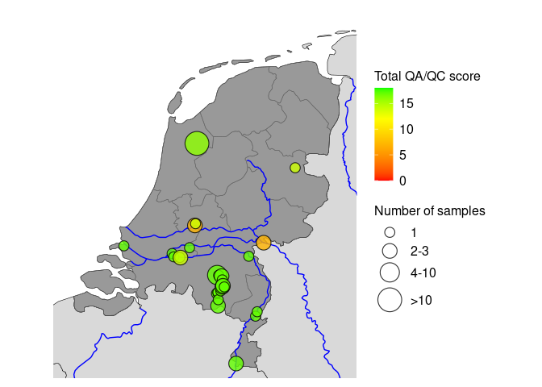
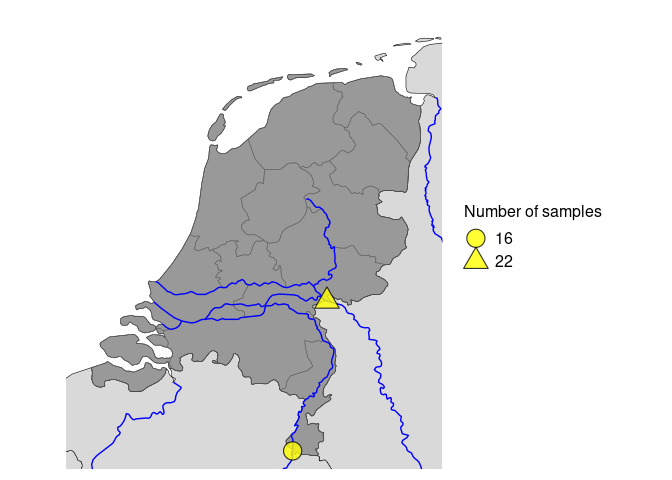
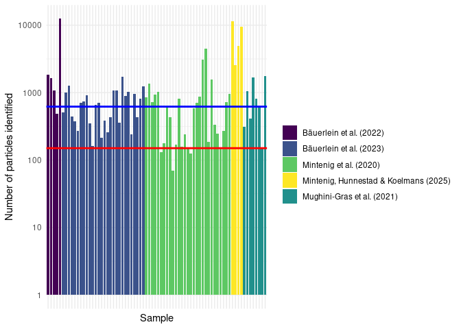

04_FiguresReportedMeasurements
================

The code below was used to make figures for paragraphs 3.1 and
Appendix 1. These figures are all related to the reported measurement
data, metadata and QA/QC scores.

# Preparation

``` r
library(tidyverse)
library(viridis)
library(ggplot2)
library(rnaturalearth)
library(rnaturalearthhires)
library(sf)

source("paths.R")
```

Create Figures folder if it does not yet exist

``` r
figures_dir <- paste0(project_dir, output_dir, "Figures/Measurements")

if (!dir.exists(figures_dir)) {
  dir.create(figures_dir, recursive = TRUE)
}
```

## Load data

First we read in the prepared data we need for making plots.

``` r
DataVersion <- "2026-07-07"

particle_concentrations_total <- readRDS(paste0(project_dir, output_dir, "Data/", 
                                                DataVersion, "Particle_concentrations_total.rds")) |> 
  filter(Data_source != "Leslie et al. (2017)")|>
  filter(!endsWith(Location_name,"*"))

particle_concentrations_polymer <- readRDS(paste0(project_dir, output_dir, "Data/", 
                                                DataVersion, "Particle_concentrations_per_polymer.rds")) |> 
  filter(Data_source != "Leslie et al. (2017)")|>
  filter(!endsWith(Location_name,"*"))

raw_ftir_data <- readRDS(paste0(project_dir, output_dir, "Data/", DataVersion, "Raw_FTIR_data.rds"))
```

Below the mass data is read in. This chunk is not run because the input
data is not publicly available.

``` r
#Read in the mass metadata
Mass_MetaData <- readxl::read_excel(paste0(Input_dir, "/RWS_2025/readme.xlsx")) |>
  left_join(readxl::read_excel(paste0(Input_dir, "/RWS_2025/readme.xlsx"), sheet = "Locations")) |>
  left_join(readxl::read_excel(paste0(Input_dir, "/RWS_2025/readme.xlsx"), sheet = "Sampling methods"))

Mass_concentrations_PP <- read_rds(paste0(project_dir, output_dir, "Data/2026-07-01-PP_SPM_Concentrations.rds"))
```

## Plot themes and colors

``` r
plot_theme = theme(
  axis.title.x = element_text(size = 16),
  axis.text = element_text(size = 14), 
  axis.title.y = element_text(size = 16)
)

source_colors <- c(
  "Bäuerlein et al. (2022)" = viridis(5)[1],
  "Bäuerlein et al. (2023)" = viridis(5)[2],
  "Mughini-Gras et al. (2021)" = viridis(5)[3],
  "Mintenig et al. (2020)" = viridis(5)[4],
  "Mintenig, Hunnestad & Koelmans (2025)" = viridis(5)[5]
)
```

# Paragraph 3.1.1

## Map particle data

Prepare plot data

``` r
sample_location_plot_data <- particle_concentrations_total |> 
  group_by(Longitude, Latitude, Total_QA_QC_score) |> 
  summarise(number_of_samples = n())

sample_location_plot_data <- sample_location_plot_data |>
  mutate(sample_group = case_when(
    number_of_samples == 1 ~ "1",
    number_of_samples %in% 2:3 ~ "2-3",
    number_of_samples %in% 4:10 ~ "4-10",
    number_of_samples > 10 ~ ">10"
  ))

sample_location_plot_data <- sample_location_plot_data |>
  mutate(
    sample_group = factor(
      sample_group,
      levels = c("1", "2-3", "4-10", ">10") # from small to large
    )
  )

size_values <- c("1" = 4, "2-3" = 6, "4-10" = 8, ">10" = 10)
```

Create plot

``` r
# Download country polygons for Europe
countries <- ne_countries(scale = "large", returnclass = "sf")

# Filter for Netherlands, Belgium, and Germany
countries_subset <- countries[countries$admin %in% c("Netherlands", "Belgium", "Germany", "France"), ]

# Assign fill colors: dark for NL, light for others
countries_subset$fill_color <- ifelse(countries_subset$admin == "Netherlands", "grey60", "grey85")

# Province borders
provinces_nl <- ne_states(country = "Netherlands", returnclass = "sf")

# Download major rivers
rivers <- ne_download(scale = "large", type = "rivers_lake_centerlines", category = "physical", returnclass = "sf")
```

    ## Reading layer `ne_10m_rivers_lake_centerlines' from data source 
    ##   `/tmp/Rtmp5yQvPE/ne_10m_rivers_lake_centerlines.shp' using driver `ESRI Shapefile'
    ## Simple feature collection with 1473 features and 38 fields
    ## Geometry type: MULTILINESTRING
    ## Dimension:     XY
    ## Bounding box:  xmin: -164.9035 ymin: -52.15775 xmax: 177.5204 ymax: 75.79348
    ## Geodetic CRS:  WGS 84

``` r
# Crop rivers to bounding box of region
bbox <- st_bbox(c(xmin = 3, ymin = 50.5, xmax = 8, ymax = 54.2))
rivers_crop <- st_crop(rivers, bbox)

ggplot() +

  geom_sf(data = countries_subset, aes(fill = fill_color), color = "black", size = 0.2) +
  scale_fill_identity() +
  geom_sf(data = provinces_nl, fill = NA, color = "grey40", size = 0.7) +
  geom_sf(data = rivers_crop, color = "blue", size = 0.5) +

  ggnewscale::new_scale_fill() +  

  geom_point(
    data = sample_location_plot_data,
    aes(
      x = Longitude, y = Latitude,
      size = sample_group,
      fill = Total_QA_QC_score
    ),
    color = "black",
    shape = 21,
    stroke = 0.6,
    alpha = 0.8
  ) +
  scale_size_manual(
    values = size_values,
    name = "Number of samples"
  ) +
  scale_fill_gradientn(
    colours = c("red", "orange", "yellow", "green"),
    values = scales::rescale(c(0, 6, 12, 18)),
    name = "Total QA/QC score",
    limits = c(0, 18)
  ) +
  coord_sf(xlim = c(3.25, 7.25), ylim = c(50.8, 53.8)) +
  theme_minimal() +
  theme(
    panel.grid = element_blank(),
    axis.title = element_blank(),
    axis.text = element_blank(),
    axis.ticks = element_blank(),
    legend.title = element_text(size = 12),
    legend.text = element_text(size = 12)
  )
```

<!-- -->

``` r
#ggsave(paste0(project_dir, output_dir, "Figures/Measurements/Map_particle_locations_particles.jpg"), dpi = 600)
```

# Paragraph 3.1.2

## Map mass data

Prepare plot data

``` r
sample_location_plot_data <- Mass_concentrations_PP |>
  left_join(Mass_MetaData) |>
  group_by(Longitude, Latitude) |> 
  summarise(number_of_samples = n())

sample_location_plot_data <- sample_location_plot_data %>%
  mutate(locatie_label = factor(number_of_samples))
```

Create plot

``` r
# Download country polygons for Europe
countries <- ne_countries(scale = "large", returnclass = "sf")

# Filter for Netherlands, Belgium, and Germany
countries_subset <- countries[countries$admin %in% c("Netherlands", "Belgium", "Germany", "France"), ]

# Assign fill colors: dark for NL, light for others
countries_subset$fill_color <- ifelse(countries_subset$admin == "Netherlands", "grey60", "grey85")

# Province borders
provinces_nl <- ne_states(country = "Netherlands", returnclass = "sf")

# Download major rivers
rivers <- ne_download(scale = "large", type = "rivers_lake_centerlines", category = "physical", returnclass = "sf")
```

    ## Reading layer `ne_10m_rivers_lake_centerlines' from data source 
    ##   `/tmp/Rtmp5yQvPE/ne_10m_rivers_lake_centerlines.shp' using driver `ESRI Shapefile'
    ## Simple feature collection with 1473 features and 38 fields
    ## Geometry type: MULTILINESTRING
    ## Dimension:     XY
    ## Bounding box:  xmin: -164.9035 ymin: -52.15775 xmax: 177.5204 ymax: 75.79348
    ## Geodetic CRS:  WGS 84

``` r
# Crop rivers to bounding box of region
bbox <- st_bbox(c(xmin = 3, ymin = 50.5, xmax = 8, ymax = 54.2))
rivers_crop <- st_crop(rivers, bbox)

ggplot() +
  geom_sf(data = countries_subset, aes(fill = fill_color), color = "black", size = 0.2) +
  geom_sf(data = provinces_nl, fill = NA, color = "grey40", size = 0.7) +
  scale_fill_identity() +
  geom_sf(data = rivers_crop, color = "blue", size = 0.5) +
  geom_point(
    data = sample_location_plot_data,
    aes(
      x = Longitude, y = Latitude,
      shape = locatie_label   
    ),
    fill = "yellow",
    color = "black",
    size = 6,           # vaste grootte
    stroke = 0.6,
    alpha = 0.8
  ) +
  scale_shape_manual(
    values = c(21, 24),   
    name = "Number of samples"
  ) +
  coord_sf(xlim = c(3.25, 7.25), ylim = c(50.8, 53.8)) +
  theme_minimal() +
  theme(
    panel.grid = element_blank(),
    axis.title = element_blank(),
    axis.text = element_blank(),
    axis.ticks = element_blank(),
    legend.title = element_text(size = 12),
    legend.text = element_text(size = 12),
    legend.spacing.y = unit(1, "cm")   
  )
```

<!-- -->

``` r
#ggsave(paste0(project_dir, output_dir, "Figures/Measurements/Map_particle_locations_mass.jpg"), dpi = 600)
```

# Appendix 1

## Histogram particles per sample counted

Log-transformed

``` r
histogram_data <- raw_ftir_data |>
  group_by(Sample_ID, Data_source) |>
  summarise(number_of_particles = n(), .groups = "drop")

ggplot(histogram_data, aes(x = Sample_ID, y = number_of_particles, fill = Data_source)) +
  geom_col() +
  scale_fill_manual(values = source_colors) +
  plot_theme +
  geom_hline(yintercept = 150, color = "red", linewidth = 1) +
  geom_hline(yintercept = 620, color = "blue", linewidth = 1) +
  labs(x = "Sample", y = "Number of particles identified", fill = "") +
  scale_y_log10() +
  theme_minimal() +
  theme(axis.text.x = element_blank())
```

<!-- -->

``` r
#ggsave(paste0(project_dir, output_dir, "Figures/Measurements/Number_of_particles_per_sample_log.jpg"),width = 7, height = 5, dpi=600)
```

# Numbers reported in the text

Number of particles under 150 and 620

``` r
hist_under_150 <- histogram_data |>
  filter(number_of_particles < 150)

print(paste0(as.character(nrow(hist_under_150)), " samples in which less than 150 particles were counted."))
```

    ## [1] "3 samples in which less than 150 particles were counted."

``` r
hist_under_620 <- histogram_data |>
  filter(number_of_particles < 620)

print(paste0(as.character(nrow(hist_under_620)), " samples in which less than 620 particles were counted."))
```

    ## [1] "33 samples in which less than 620 particles were counted."
