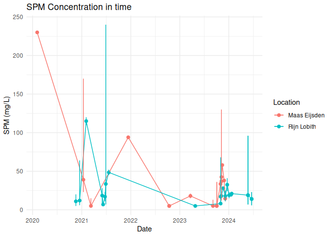

05_ReportTables
================

The code below was used to make tables for paragraph 3.1 and Appendix 1.
These tables are all related to the reported measurement data, metadata
and QA/QC scores.

# Preparation

``` r
library(tidyverse)
library(readxl)
source("paths.R")
DataVersion <- "2026-07-07"
```

## Load data

First we read in the prepared data we need for making plots.

``` r
particle_concentrations_total <- readRDS(paste0(project_dir, output_dir, "Data/", DataVersion, "Particle_concentrations_total.rds"))|> 
  filter(Data_source != "Leslie et al. (2017)") |>
    filter(!endsWith(Location_name,"*"))

particle_concentrations_polymer <- readRDS(paste0(project_dir, output_dir, "Data/", DataVersion, "Particle_concentrations_per_polymer.rds"))|> 
  filter(Data_source != "Leslie et al. (2017)") |>
  filter(!endsWith(Location_name,"*"))

raw_ftir_data <- readRDS(paste0(project_dir, output_dir, 
                                "Data/", DataVersion, "Raw_FTIR_data.rds"))
```

Below the mass data is read in. This chunk is not run because the input
data is not publicly available.

``` r
# Read in the mass metadata
Mass_MetaData <- read_excel(paste0(Input_dir, "/RWS_2025/readme.xlsx")) |>
  left_join(read_excel(paste0(Input_dir, "/RWS_2025/readme.xlsx"), sheet = "Locations")) |>
  left_join(read_excel(paste0(Input_dir, "/RWS_2025/readme.xlsx"), sheet = "Sampling methods"))

Mass_concentrations_PP <- read_rds(paste0(project_dir, output_dir, "Data/2026-07-01-PP_SPM_Concentrations.rds"))
```

# Paragraph 2.3

## Suspended Particulate Matter

``` r
spm_data <- Mass_concentrations_PP |>
  select(Location_name, Sampling_date_from, Sampling_date_to, SPM_mg_L_median, SPM_mg_L_min, SPM_mg_L_max)

# openxlsx::write.xlsx(spm_data, file = paste0(project_dir,output_dir, "Tables/All_SPM.xlsx"))

spm_data$Sampling_date_from <- as.Date(spm_data$Sampling_date_from)
spm_data$Sampling_date_to <- as.Date(spm_data$Sampling_date_to)

ggplot(spm_data, aes(x = Sampling_date_from, 
                     y = SPM_mg_L_median, 
                     color = Location_name)) +
  geom_point(size = 2) +
  geom_line(aes(group = Location_name)) +
  geom_errorbar(aes(ymin = SPM_mg_L_min, ymax = SPM_mg_L_max), width = 0.2) +
  labs(title = "SPM Concentration in time",
       x = "Date",
       y = "SPM (mg/L)",
       color = "Location") +
  theme_minimal()
```

<!-- -->

``` r
spm_summary <- spm_data %>%
  group_by(Location_name) %>%
  summarise(
    n = n(),
    median_SPM = signif(median(SPM_mg_L_median, na.rm = TRUE), 2),
    min_SPM = signif(min(SPM_mg_L_min, na.rm = TRUE), 2),
    max_SPM = signif(max(SPM_mg_L_max, na.rm = TRUE), 2)
  )

knitr::kable(spm_summary)
```

| Location_name |   n | median_SPM | min_SPM | max_SPM |
|:--------------|----:|-----------:|--------:|--------:|
| Maas Eijsden  |  16 |         26 |       5 |     230 |
| Rijn Lobith   |  22 |         18 |       5 |     240 |

``` r
#openxlsx::write.xlsx(spm_summary, file = paste0(output_dir, "Tables/SPM_summary.xlsx"))
```

# Paragraph 3.1.2

## Mass overview table

Tis table is based on mass data, so the chunk is not run.

``` r
Mass_table_summary <- Mass_concentrations_PP |>
  left_join(Mass_MetaData) |>
  filter(!is.na(Sampling_method)) |>
  filter(!is.na(Sampling_date_from)) |>
  filter(Sampling_date_from >= as.Date("2020-01-01")) |>
  group_by(Location_name, River) |>
  summarise(
    Sampling_methods = paste(na.omit(unique(Sampling_method)), collapse = ", "),
    Sampling_period = case_when(
      all(is.na(Sampling_date_from)) ~ NA_character_,
      all(is.na(Sampling_date_to)) | all(Sampling_date_from == Sampling_date_to, na.rm = TRUE) ~
        paste0(min(Sampling_date_from, na.rm = TRUE)),
      TRUE ~ paste0(
        min(Sampling_date_from, na.rm = TRUE), " t/m ", max(Sampling_date_to, na.rm = TRUE)
      )
    ),
    n_samples = n(),  # aantal rijen per groep
    .groups = "drop"
  ) |>
  mutate(
    Sampling_period = ifelse(
      is.na(Sampling_period) | Sampling_period %in% c("NA", "NA t/m NA"),
      "Not reported",
      Sampling_period
    )
  ) 
knitr::kable(Mass_table_summary)
```

| Location_name | River | Sampling_methods | Sampling_period | n_samples |
|:---|:---|:---|:---|---:|
| Maas Eijsden | Bovenmaas | centrifuge, sediment kist | 2020-02-04 t/m 2023-12-05 | 16 |
| Rijn Lobith | Bovenrijn | centrifuge, sediment kist | 2020-11-18 t/m 2024-07-17 | 22 |

``` r
#openxlsx::write.xlsx(Mass_table_summary, file = paste0(output_dir, "Tables/Mass_overview.xlsx"))
```

# Paragraph 3.1.1

## Particle overview table

``` r
particle_overview_table_conc <- particle_concentrations_total |>
  group_by(River, Analysis_method, Data_source, Sampling_method,Lower_sampling_size_limit_um, Upper_sampling_size_limit_um, Total_QA_QC_score) |>
  summarise(average_sample_vol_L = mean(Sample_volume_L), 
            number_of_samples = n_distinct(Sample_ID),
            min_date = min(sampling_date, na.rm = TRUE),
            max_date = max(sampling_date, na.rm = TRUE),
            .groups = "drop") |>
  select(River, min_date, max_date, number_of_samples, Sampling_method, average_sample_vol_L, Analysis_method, Lower_sampling_size_limit_um, Upper_sampling_size_limit_um, Total_QA_QC_score, Data_source)

particle_overview_table_raw <- raw_ftir_data |>
  group_by(River, Analysis_method, Data_source, Sampling_method,Lower_sampling_size_limit_um, Upper_sampling_size_limit_um) |>
  summarise(number_of_particles = n(),
            .groups = "drop") |>
  select(River, Sampling_method, Analysis_method, number_of_particles, Lower_sampling_size_limit_um, Upper_sampling_size_limit_um, Data_source)

particle_overview_table <- particle_overview_table_conc |>
  left_join(particle_overview_table_raw) |>
    select(River, min_date, max_date, number_of_samples, Sampling_method, average_sample_vol_L, Analysis_method, number_of_particles, Total_QA_QC_score, Lower_sampling_size_limit_um, Upper_sampling_size_limit_um, Data_source)

knitr::kable(particle_overview_table)
```

| River | min_date | max_date | number_of_samples | Sampling_method | average_sample_vol_L | Analysis_method | number_of_particles | Total_QA_QC_score | Lower_sampling_size_limit_um | Upper_sampling_size_limit_um | Data_source |
|:---|:---|:---|---:|:---|---:|:---|---:|---:|---:|---:|:---|
| Dommel | 2017-10-09 | 2018-08-21 | 18 | Cascade | 5065.444 | ATR-FTIR and Micro-FTIR | 15375 | 17 | 20 | 5000 | Mintenig et al. (2020) |
| Dommel | 2024-10-31 | 2024-11-01 | 4 | Cascade, planktonnet | 1809.500 | ATR-FTIR and Micro-FTIR | 28459 | 17 | 20 | 5000 | Mintenig, Hunnestad & Koelmans (2025) |
| Lek canal | 1-08-20 | 1-08-20 | 1 | Cascade | 1000.000 | LDIR | 12438 | 14 | 10 | 500 | Bäuerlein et al. (2022) |
| Lek canal | 2019-07-01 | 2020-01-01 | 2 | Cascade | 600.000 | LDIR | 3354 | 7 | 10 | 500 | Mughini-Gras et al. (2021) |
| Meuse | 2017-10-04 | 2018-06-07 | 11 | Cascade | 7665.636 | ATR-FTIR and Micro-FTIR | 6837 | 17 | 20 | 5000 | Mintenig et al. (2020) |
| Meuse | 6-10-20 | 23-09-20 | 3 | Cascade | 1000.000 | LDIR | 4576 | 14 | 10 | 500 | Bäuerlein et al. (2022) |
| Overijsselse vecht | 9-07-20 | 9-07-20 | 1 | Cascade | 1000.000 | LDIR | 490 | 14 | 10 | 500 | Bäuerlein et al. (2022) |
| Rhine | 2019-07-01 | 2020-01-01 | 2 | Cascade | 600.000 | LDIR | 3482 | 7 | 10 | 500 | Mughini-Gras et al. (2021) |
| WWTP Werverschoof effluent canal | 2019-07-04 | 2019-11-14 | 28 | Cascade | 500.000 | LDIR | 19206 | 16 | 20 | 500 | Bäuerlein et al. (2023) |

``` r
#openxlsx::write.xlsx(particle_overview_table, file = paste0(output_dir, "/Tables/Table_3_v2.xlsx"))
```

# Appendix 4

## Aligned concentration per sample per polymer

``` r
# Pivot naar breed formaat
polymer_shares <- rbind(particle_concentrations_polymer, particle_concentrations_total) |>
  select(Polymer, Sample_ID, River, Data_source, Analysis_method, concentration, unit) |>
  pivot_wider(names_from = "Polymer", values_from = "concentration")

id_cols <- c("Sample_ID", "River", "Data_source", "Analysis_method", "unit", "Total")

polymer_shares <- rbind(particle_concentrations_polymer, particle_concentrations_total) %>%
  select(Polymer, Sample_ID, River, Data_source, Analysis_method, concentration, unit) %>%
  pivot_wider(names_from = "Polymer", values_from = "concentration") %>%
  mutate(across(
    .cols = setdiff(names(.), id_cols),
    .fns = ~ .x / Total,
    .names = "frac_{.col}"
  )) %>%
  drop_na(Total)

polymer_shares <- polymer_shares %>%
  select(c(id_cols, starts_with("frac"))) %>%
  mutate(frac_Total = 1)

# Aligned concentrations
aligned_concentrations <- readRDS(paste0(project_dir, output_dir, "Data/Rescaled_concentrations_2026-05-13.Rds")) |>
  filter(OptionType == "concentrationOption3") |>
  select(Sample_ID, UncId, concentration) |>
  rename(concentration_total_aligned = concentration)

# Join the aligned concentrations and polymer shares
aligned_per_polymer <- polymer_shares |>
  left_join(aligned_concentrations) |>
  mutate(
    across(
      starts_with("frac_"),
      ~ .x * concentration_total_aligned,
      .names = "{str_remove(.col, 'frac_')}_#_m3"
    )
  ) |>
  select(-starts_with("frac_")) |>
  select(-c("UncId", "unit", "Total", "concentration_total_aligned", "River", "Data_source", "Analysis_method")) |>
  group_by(Sample_ID) |>
  summarise(
    across(
      ends_with("m3"),
      list(
        mean = ~mean(.x, na.rm = TRUE),
        q5   = ~quantile(.x, 0.05, na.rm = TRUE),
        q95  = ~quantile(.x, 0.95, na.rm = TRUE)
      ),
      .names = "{.col}_{.fn}"
    )
  )

polymer_cols <- aligned_per_polymer %>%
  select(ends_with("_mean")) %>%
  names()

for (col in polymer_cols) {
  base <- str_remove(col, "_mean$")
  aligned_per_polymer[[paste0(base, "_summary")]] <-
    sprintf(
      "%s (%s - %s)",
      format(round(aligned_per_polymer[[paste0(base, "_mean")]], 0), scientific = TRUE, trim = TRUE, digits = 1),
      format(round(aligned_per_polymer[[paste0(base, "_q5")]], 0), scientific = TRUE, trim = TRUE, digits = 1),
      format(round(aligned_per_polymer[[paste0(base, "_q95")]], 0), scientific = TRUE, trim = TRUE, digits = 1)
    )
}

summary_cols <- aligned_per_polymer %>%
  select(ends_with("_summary")) %>%
  names()

aligned_per_polymer <- aligned_per_polymer %>%
  mutate(
    across(
      all_of(summary_cols),
      ~ ifelse(. %in% c("NaN (NA - NA)"), "ND", .)
    )
  )

# Samples without polymer distribution available
special_ids <- c("Mintenig_2020_42", "Mintenig_2020_43", "Mintenig_2020_44",
                 "Mintenig_2020_45", "Mintenig_2020_46", "Mintenig_2020_47",
                 "Mintenig_2020_48", "Mintenig_2020_49", "Mintenig_2020_50")

final_table <- aligned_per_polymer |>
  select(c(Sample_ID, ends_with("summary"))) %>%
  rename_with(
    ~ str_replace(., "_#_m3_summary$", ""),
    ends_with("_summary")
  ) %>%
 mutate(
    across(
      # selecteer alle kolommen behalve "Sample_ID" en "Total"
      .cols = -c(Sample_ID, Total),
      .fns = ~ ifelse(Sample_ID %in% special_ids, "*", .)
    )) |> 
  rename(`Sample ID` = Sample_ID)

knitr::kable(final_table)
```

| Sample ID | ABS | Acryl | Other synthetic rubbers | Others | PA | PC | PE | PET | PMMA | PP | PS | PUR | PVC | EPDM | NR | SBR | Total |
|:---|:---|:---|:---|:---|:---|:---|:---|:---|:---|:---|:---|:---|:---|:---|:---|:---|:---|
| Bäuerlein_2022_1 | 1e+05 (7e+04 - 2e+05) | 4e+04 (2e+04 - 7e+04) | 3e+06 (2e+06 - 5e+06) | 3e+06 (1e+06 - 4e+06) | 1e+07 (6e+06 - 2e+07) | 2e+05 (1e+05 - 3e+05) | 9e+06 (5e+06 - 1e+07) | 1e+07 (6e+06 - 2e+07) | ND | 2e+06 (1e+06 - 4e+06) | 4e+04 (2e+04 - 7e+04) | 2e+06 (9e+05 - 2e+06) | 8e+05 (5e+05 - 1e+06) | ND | ND | ND | 4e+07 (2e+07 - 6e+07) |
| Bäuerlein_2022_2 | 1e+05 (6e+04 - 2e+05) | 3e+04 (2e+04 - 5e+04) | 7e+06 (4e+06 - 1e+07) | 2e+06 (1e+06 - 3e+06) | 1e+07 (6e+06 - 2e+07) | 2e+05 (1e+05 - 3e+05) | 3e+06 (2e+06 - 4e+06) | 4e+06 (2e+06 - 6e+06) | 3e+04 (2e+04 - 5e+04) | 2e+05 (1e+05 - 3e+05) | 3e+05 (2e+05 - 4e+05) | 7e+05 (4e+05 - 1e+06) | 2e+06 (9e+05 - 2e+06) | ND | ND | ND | 3e+07 (2e+07 - 4e+07) |
| Bäuerlein_2022_3 | 4e+04 (2e+04 - 6e+04) | ND | 4e+06 (2e+06 - 7e+06) | 1e+06 (7e+05 - 2e+06) | 6e+06 (4e+06 - 1e+07) | 3e+05 (1e+05 - 4e+05) | 2e+06 (1e+06 - 4e+06) | 3e+06 (2e+06 - 4e+06) | 5e+04 (3e+04 - 9e+04) | 1e+06 (6e+05 - 2e+06) | 1e+05 (6e+04 - 2e+05) | 5e+05 (3e+05 - 9e+05) | 6e+05 (3e+05 - 9e+05) | ND | ND | ND | 2e+07 (1e+07 - 3e+07) |
| Bäuerlein_2022_4 | 7e+03 (3e+03 - 1e+04) | ND | 2e+05 (7e+04 - 4e+05) | 5e+05 (2e+05 - 1e+06) | 6e+05 (2e+05 - 1e+06) | 1e+04 (5e+03 - 3e+04) | 8e+05 (3e+05 - 2e+06) | 9e+05 (3e+05 - 2e+06) | 2e+04 (8e+03 - 4e+04) | 2e+05 (6e+04 - 4e+05) | 2e+04 (8e+03 - 4e+04) | 3e+05 (1e+05 - 6e+05) | 9e+04 (3e+04 - 2e+05) | ND | ND | ND | 4e+06 (1e+06 - 7e+06) |
| Bäuerlein_2022_5 | 1e+06 (6e+05 - 2e+06) | 1e+05 (7e+04 - 2e+05) | 1e+07 (6e+06 - 2e+07) | 2e+07 (8e+06 - 3e+07) | 6e+07 (3e+07 - 1e+08) | 8e+06 (4e+06 - 1e+07) | 1e+07 (6e+06 - 2e+07) | 6e+07 (3e+07 - 1e+08) | 2e+05 (1e+05 - 4e+05) | 5e+06 (2e+06 - 8e+06) | 3e+05 (2e+05 - 5e+05) | 6e+06 (3e+06 - 1e+07) | 8e+06 (4e+06 - 1e+07) | ND | ND | ND | 2e+08 (9e+07 - 3e+08) |
| Bäuerlein_2023_1 | ND | ND | 7e+05 (6e+05 - 8e+05) | 4e+05 (4e+05 - 5e+05) | 2e+06 (1e+06 - 2e+06) | ND | 4e+05 (4e+05 - 5e+05) | 2e+05 (1e+05 - 2e+05) | ND | 4e+05 (4e+05 - 5e+05) | 1e+05 (1e+05 - 1e+05) | 2e+05 (2e+05 - 2e+05) | 7e+05 (6e+05 - 8e+05) | ND | ND | ND | 5e+06 (4e+06 - 5e+06) |
| Bäuerlein_2023_11 | 5e+03 (4e+03 - 6e+03) | 1e+04 (9e+03 - 1e+04) | 9e+05 (8e+05 - 1e+06) | 5e+05 (4e+05 - 5e+05) | 1e+06 (1e+06 - 2e+06) | 2e+04 (2e+04 - 2e+04) | 7e+05 (6e+05 - 8e+05) | 6e+05 (5e+05 - 7e+05) | 5e+03 (4e+03 - 6e+03) | 3e+05 (3e+05 - 4e+05) | 3e+04 (2e+04 - 3e+04) | 3e+05 (3e+05 - 4e+05) | 2e+05 (1e+05 - 2e+05) | ND | ND | ND | 5e+06 (4e+06 - 6e+06) |
| Bäuerlein_2023_12 | ND | 2e+03 (2e+03 - 2e+03) | 7e+04 (6e+04 - 8e+04) | 3e+05 (3e+05 - 4e+05) | 2e+05 (2e+05 - 2e+05) | 2e+04 (2e+04 - 3e+04) | 8e+04 (7e+04 - 9e+04) | 1e+05 (1e+05 - 1e+05) | ND | 2e+04 (2e+04 - 2e+04) | 1e+04 (1e+04 - 1e+04) | 3e+04 (3e+04 - 3e+04) | 2e+04 (2e+04 - 3e+04) | ND | ND | ND | 9e+05 (8e+05 - 1e+06) |
| Bäuerlein_2023_13 | ND | ND | 4e+04 (3e+04 - 4e+04) | 9e+04 (8e+04 - 1e+05) | 9e+04 (8e+04 - 1e+05) | ND | 6e+04 (5e+04 - 7e+04) | 5e+04 (5e+04 - 6e+04) | ND | 3e+04 (3e+04 - 4e+04) | 2e+04 (2e+04 - 3e+04) | 3e+04 (3e+04 - 4e+04) | 2e+05 (2e+05 - 2e+05) | ND | ND | ND | 6e+05 (5e+05 - 7e+05) |
| Bäuerlein_2023_15 | ND | ND | 1e+05 (1e+05 - 2e+05) | 4e+05 (3e+05 - 5e+05) | 3e+05 (3e+05 - 4e+05) | ND | 1e+05 (1e+05 - 2e+05) | 6e+04 (5e+04 - 7e+04) | ND | 8e+04 (7e+04 - 9e+04) | 5e+04 (4e+04 - 6e+04) | 1e+05 (1e+05 - 1e+05) | 5e+05 (5e+05 - 6e+05) | ND | ND | ND | 2e+06 (2e+06 - 2e+06) |
| Bäuerlein_2023_16 | ND | ND | 6e+04 (6e+04 - 7e+04) | 1e+05 (1e+05 - 2e+05) | 2e+05 (1e+05 - 2e+05) | ND | 8e+04 (7e+04 - 9e+04) | 5e+04 (4e+04 - 6e+04) | ND | 3e+04 (2e+04 - 3e+04) | 2e+04 (1e+04 - 2e+04) | 1e+05 (1e+05 - 1e+05) | 2e+05 (2e+05 - 3e+05) | ND | ND | ND | 9e+05 (8e+05 - 1e+06) |
| Bäuerlein_2023_17 | 6e+03 (5e+03 - 7e+03) | 1e+04 (1e+04 - 1e+04) | 4e+05 (3e+05 - 4e+05) | 3e+05 (3e+05 - 4e+05) | 4e+05 (4e+05 - 5e+05) | 6e+03 (5e+03 - 7e+03) | 3e+05 (3e+05 - 4e+05) | 3e+05 (3e+05 - 4e+05) | 9e+03 (8e+03 - 1e+04) | 1e+05 (1e+05 - 1e+05) | 4e+04 (4e+04 - 5e+04) | 6e+04 (5e+04 - 7e+04) | 1e+05 (1e+05 - 2e+05) | ND | ND | ND | 2e+06 (2e+06 - 3e+06) |
| Bäuerlein_2023_18 | ND | 1e+04 (1e+04 - 1e+04) | 2e+05 (2e+05 - 3e+05) | 8e+05 (7e+05 - 9e+05) | 4e+05 (3e+05 - 4e+05) | 4e+03 (4e+03 - 5e+03) | 6e+05 (5e+05 - 6e+05) | 4e+05 (4e+05 - 5e+05) | 4e+03 (4e+03 - 5e+03) | 3e+05 (2e+05 - 3e+05) | 2e+04 (2e+04 - 3e+04) | 3e+05 (3e+05 - 3e+05) | 7e+04 (7e+04 - 9e+04) | ND | ND | ND | 3e+06 (3e+06 - 4e+06) |
| Bäuerlein_2023_19 | ND | 2e+04 (2e+04 - 2e+04) | 6e+05 (5e+05 - 7e+05) | 5e+05 (4e+05 - 5e+05) | 8e+05 (7e+05 - 9e+05) | 8e+03 (7e+03 - 9e+03) | 5e+05 (4e+05 - 6e+05) | 4e+05 (3e+05 - 4e+05) | 1e+04 (1e+04 - 1e+04) | 3e+05 (3e+05 - 4e+05) | 7e+04 (6e+04 - 8e+04) | 2e+05 (2e+05 - 2e+05) | 2e+05 (2e+05 - 3e+05) | ND | ND | ND | 4e+06 (3e+06 - 4e+06) |
| Bäuerlein_2023_2 | ND | ND | 2e+05 (2e+05 - 3e+05) | 5e+05 (4e+05 - 6e+05) | 6e+05 (5e+05 - 7e+05) | ND | 2e+05 (1e+05 - 2e+05) | 7e+04 (6e+04 - 8e+04) | ND | 2e+05 (2e+05 - 2e+05) | 5e+04 (4e+04 - 6e+04) | 8e+04 (7e+04 - 9e+04) | 3e+05 (2e+05 - 3e+05) | ND | ND | ND | 2e+06 (2e+06 - 2e+06) |
| Bäuerlein_2023_20 | ND | ND | 1e+05 (1e+05 - 2e+05) | 6e+04 (5e+04 - 7e+04) | 5e+05 (5e+05 - 6e+05) | ND | 2e+05 (2e+05 - 3e+05) | 9e+04 (8e+04 - 1e+05) | ND | 1e+05 (9e+04 - 1e+05) | 4e+04 (4e+04 - 5e+04) | 5e+04 (4e+04 - 6e+04) | 7e+04 (6e+04 - 8e+04) | ND | ND | ND | 1e+06 (1e+06 - 2e+06) |
| Bäuerlein_2023_22 | ND | ND | 1e+06 (9e+05 - 1e+06) | 6e+05 (5e+05 - 7e+05) | 2e+06 (2e+06 - 3e+06) | ND | 6e+05 (6e+05 - 7e+05) | 2e+05 (2e+05 - 2e+05) | ND | 4e+05 (3e+05 - 4e+05) | 2e+05 (1e+05 - 2e+05) | 3e+05 (2e+05 - 3e+05) | 6e+05 (5e+05 - 7e+05) | ND | ND | ND | 6e+06 (5e+06 - 7e+06) |
| Bäuerlein_2023_23 | ND | ND | 7e+05 (6e+05 - 7e+05) | 7e+05 (6e+05 - 8e+05) | 3e+06 (3e+06 - 4e+06) | ND | 6e+05 (5e+05 - 7e+05) | 9e+04 (8e+04 - 1e+05) | ND | 6e+05 (5e+05 - 7e+05) | 9e+04 (8e+04 - 1e+05) | 1e+05 (1e+05 - 2e+05) | 4e+05 (4e+05 - 5e+05) | ND | ND | ND | 7e+06 (6e+06 - 8e+06) |
| Bäuerlein_2023_24 | ND | ND | 2e+05 (1e+05 - 2e+05) | 2e+05 (2e+05 - 2e+05) | 1e+06 (1e+06 - 1e+06) | ND | 3e+05 (3e+05 - 3e+05) | 6e+04 (5e+04 - 7e+04) | ND | 9e+04 (8e+04 - 1e+05) | 2e+04 (2e+04 - 2e+04) | 5e+04 (4e+04 - 6e+04) | 2e+05 (2e+05 - 2e+05) | ND | ND | ND | 2e+06 (2e+06 - 2e+06) |
| Bäuerlein_2023_25 | ND | ND | 2e+05 (2e+05 - 3e+05) | 1e+06 (9e+05 - 1e+06) | 2e+06 (2e+06 - 2e+06) | ND | 3e+05 (3e+05 - 4e+05) | 2e+05 (2e+05 - 3e+05) | ND | 9e+04 (8e+04 - 1e+05) | 4e+04 (4e+04 - 5e+04) | 3e+04 (3e+04 - 4e+04) | 3e+05 (3e+05 - 4e+05) | ND | ND | ND | 4e+06 (4e+06 - 5e+06) |
| Bäuerlein_2023_26 | ND | ND | 4e+05 (3e+05 - 4e+05) | 2e+05 (2e+05 - 3e+05) | 1e+06 (9e+05 - 1e+06) | ND | 4e+05 (4e+05 - 5e+05) | 1e+05 (9e+04 - 1e+05) | ND | 1e+05 (1e+05 - 2e+05) | 3e+04 (3e+04 - 3e+04) | 9e+04 (8e+04 - 1e+05) | 2e+05 (2e+05 - 2e+05) | ND | ND | ND | 3e+06 (2e+06 - 3e+06) |
| Bäuerlein_2023_27 | ND | ND | 6e+05 (6e+05 - 7e+05) | 2e+05 (2e+05 - 3e+05) | 2e+06 (1e+06 - 2e+06) | ND | 7e+05 (6e+05 - 8e+05) | 2e+05 (2e+05 - 2e+05) | ND | 5e+05 (4e+05 - 5e+05) | 3e+04 (3e+04 - 4e+04) | 2e+05 (1e+05 - 2e+05) | 7e+05 (7e+05 - 9e+05) | ND | ND | ND | 5e+06 (4e+06 - 5e+06) |
| Bäuerlein_2023_28 | 2e+03 (1e+03 - 2e+03) | 2e+03 (1e+03 - 2e+03) | 3e+05 (3e+05 - 4e+05) | 4e+05 (3e+05 - 4e+05) | 4e+05 (3e+05 - 4e+05) | 2e+03 (1e+03 - 2e+03) | 2e+05 (2e+05 - 3e+05) | 1e+05 (1e+05 - 2e+05) | ND | 7e+04 (6e+04 - 8e+04) | 8e+03 (7e+03 - 9e+03) | 6e+04 (5e+04 - 7e+04) | 7e+04 (6e+04 - 8e+04) | ND | ND | ND | 2e+06 (1e+06 - 2e+06) |
| Bäuerlein_2023_29 | 2e+04 (2e+04 - 2e+04) | 1e+04 (9e+03 - 1e+04) | 3e+05 (2e+05 - 3e+05) | 8e+05 (7e+05 - 9e+05) | 4e+05 (3e+05 - 4e+05) | ND | 7e+05 (6e+05 - 8e+05) | 6e+05 (5e+05 - 7e+05) | 4e+04 (3e+04 - 4e+04) | 2e+05 (2e+05 - 3e+05) | 2e+04 (2e+04 - 2e+04) | 6e+05 (6e+05 - 7e+05) | 2e+05 (2e+05 - 3e+05) | ND | ND | ND | 4e+06 (3e+06 - 4e+06) |
| Bäuerlein_2023_3 | ND | ND | 3e+06 (2e+06 - 3e+06) | 2e+06 (1e+06 - 2e+06) | 5e+06 (4e+06 - 5e+06) | ND | 3e+06 (2e+06 - 3e+06) | 2e+05 (1e+05 - 2e+05) | ND | 2e+06 (2e+06 - 3e+06) | 3e+05 (3e+05 - 4e+05) | 1e+06 (1e+06 - 2e+06) | 3e+06 (2e+06 - 3e+06) | ND | ND | ND | 2e+07 (2e+07 - 2e+07) |
| Bäuerlein_2023_30 | 1e+04 (9e+03 - 1e+04) | 3e+04 (2e+04 - 3e+04) | 3e+05 (3e+05 - 4e+05) | 2e+06 (1e+06 - 2e+06) | 5e+05 (4e+05 - 6e+05) | 1e+04 (1e+04 - 1e+04) | 9e+05 (8e+05 - 1e+06) | 9e+05 (8e+05 - 1e+06) | 1e+04 (1e+04 - 1e+04) | 4e+05 (3e+05 - 4e+05) | 3e+04 (3e+04 - 4e+04) | 8e+05 (7e+05 - 9e+05) | 1e+05 (1e+05 - 1e+05) | ND | ND | ND | 6e+06 (5e+06 - 6e+06) |
| Bäuerlein_2023_31 | 2e+03 (2e+03 - 3e+03) | ND | 5e+05 (4e+05 - 5e+05) | 2e+05 (2e+05 - 2e+05) | 5e+05 (5e+05 - 6e+05) | 7e+03 (6e+03 - 8e+03) | 4e+05 (3e+05 - 4e+05) | 2e+05 (2e+05 - 2e+05) | ND | 7e+04 (6e+04 - 8e+04) | 4e+04 (3e+04 - 4e+04) | 7e+04 (6e+04 - 8e+04) | 1e+05 (1e+05 - 1e+05) | ND | ND | ND | 2e+06 (2e+06 - 2e+06) |
| Bäuerlein_2023_32 | ND | 1e+04 (1e+04 - 2e+04) | 8e+05 (7e+05 - 9e+05) | 5e+05 (5e+05 - 6e+05) | 9e+05 (8e+05 - 1e+06) | 6e+04 (5e+04 - 7e+04) | 8e+05 (7e+05 - 9e+05) | 6e+05 (5e+05 - 7e+05) | 4e+03 (4e+03 - 5e+03) | 4e+05 (3e+05 - 4e+05) | 1e+05 (9e+04 - 1e+05) | 2e+05 (1e+05 - 2e+05) | 3e+05 (3e+05 - 4e+05) | ND | ND | ND | 5e+06 (4e+06 - 5e+06) |
| Bäuerlein_2023_4 | ND | ND | 3e+05 (2e+05 - 3e+05) | 2e+05 (2e+05 - 2e+05) | 5e+05 (4e+05 - 6e+05) | ND | 2e+05 (2e+05 - 2e+05) | 7e+04 (6e+04 - 8e+04) | ND | 1e+05 (8e+04 - 1e+05) | 4e+04 (3e+04 - 4e+04) | 9e+04 (8e+04 - 1e+05) | 3e+05 (3e+05 - 4e+05) | ND | ND | ND | 2e+06 (2e+06 - 2e+06) |
| Bäuerlein_2023_5 | ND | ND | 5e+05 (4e+05 - 5e+05) | 9e+04 (8e+04 - 1e+05) | 4e+05 (4e+05 - 5e+05) | 8e+03 (7e+03 - 9e+03) | 2e+05 (2e+05 - 2e+05) | 3e+05 (3e+05 - 3e+05) | 8e+03 (7e+03 - 9e+03) | 1e+05 (1e+05 - 2e+05) | 3e+04 (2e+04 - 3e+04) | 1e+05 (1e+05 - 1e+05) | 1e+05 (9e+04 - 1e+05) | ND | ND | ND | 2e+06 (2e+06 - 2e+06) |
| Bäuerlein_2023_7 | ND | ND | 9e+05 (8e+05 - 1e+06) | 3e+05 (3e+05 - 4e+05) | 1e+06 (9e+05 - 1e+06) | 4e+04 (4e+04 - 5e+04) | 6e+05 (5e+05 - 7e+05) | 9e+05 (8e+05 - 1e+06) | ND | 3e+05 (2e+05 - 3e+05) | 4e+04 (4e+04 - 5e+04) | 4e+05 (4e+05 - 5e+05) | 3e+05 (2e+05 - 3e+05) | ND | ND | ND | 5e+06 (4e+06 - 6e+06) |
| Bäuerlein_2023_8 | 1e+04 (1e+04 - 2e+04) | 1e+04 (1e+04 - 2e+04) | 6e+05 (5e+05 - 7e+05) | 3e+05 (2e+05 - 3e+05) | 9e+05 (8e+05 - 1e+06) | ND | 4e+05 (4e+05 - 5e+05) | 2e+05 (2e+05 - 3e+05) | ND | 1e+05 (1e+05 - 2e+05) | 4e+04 (3e+04 - 4e+04) | 1e+05 (1e+05 - 2e+05) | 2e+05 (2e+05 - 2e+05) | ND | ND | ND | 3e+06 (3e+06 - 3e+06) |
| Bäuerlein_2023_9 | ND | 4e+03 (4e+03 - 5e+03) | 9e+05 (8e+05 - 1e+06) | 9e+05 (8e+05 - 1e+06) | 1e+06 (1e+06 - 1e+06) | ND | 6e+05 (5e+05 - 7e+05) | 9e+05 (7e+05 - 1e+06) | 8e+03 (7e+03 - 1e+04) | 2e+05 (2e+05 - 2e+05) | 2e+04 (2e+04 - 2e+04) | 3e+05 (3e+05 - 4e+05) | 2e+05 (2e+05 - 2e+05) | ND | ND | ND | 5e+06 (5e+06 - 6e+06) |
| Mintenig,*Hunnestad*&\_Koelmans_2025_1 | 9e+02 (8e+02 - 1e+03) | 8e+04 (7e+04 - 1e+05) | 6e+03 (6e+03 - 7e+03) | 5e+03 (4e+03 - 5e+03) | 0e+00 (0e+00 - 0e+00) | ND | 8e+05 (7e+05 - 9e+05) | 8e+03 (7e+03 - 9e+03) | ND | 5e+05 (5e+05 - 6e+05) | 2e+03 (1e+03 - 2e+03) | ND | 3e+04 (3e+04 - 3e+04) | 4e+05 (3e+05 - 4e+05) | ND | 1e+02 (1e+02 - 1e+02) | 2e+06 (2e+06 - 2e+06) |
| Mintenig,*Hunnestad*&\_Koelmans_2025_2 | ND | 4e+03 (4e+03 - 5e+03) | 2e+02 (2e+02 - 2e+02) | 3e+02 (3e+02 - 3e+02) | 0e+00 (0e+00 - 0e+00) | ND | 2e+04 (2e+04 - 2e+04) | 6e+01 (5e+01 - 7e+01) | ND | 4e+04 (4e+04 - 5e+04) | 2e+02 (2e+02 - 3e+02) | ND | 5e+02 (4e+02 - 5e+02) | 1e+04 (9e+03 - 1e+04) | ND | 6e+01 (5e+01 - 7e+01) | 8e+04 (7e+04 - 9e+04) |
| Mintenig,*Hunnestad*&\_Koelmans_2025_3 | ND | 2e+04 (2e+04 - 2e+04) | 1e+02 (1e+02 - 1e+02) | 4e+03 (3e+03 - 4e+03) | 0e+00 (0e+00 - 0e+00) | ND | 4e+05 (3e+05 - 4e+05) | 5e+03 (5e+03 - 6e+03) | ND | 2e+05 (1e+05 - 2e+05) | 6e+02 (6e+02 - 7e+02) | ND | 2e+03 (2e+03 - 3e+03) | 1e+05 (1e+05 - 1e+05) | ND | 4e+02 (4e+02 - 5e+02) | 7e+05 (6e+05 - 8e+05) |
| Mintenig,*Hunnestad*&\_Koelmans_2025_4 | 2e+02 (2e+02 - 2e+02) | 2e+04 (2e+04 - 3e+04) | 2e+03 (1e+03 - 2e+03) | 6e+03 (6e+03 - 7e+03) | 0e+00 (0e+00 - 0e+00) | ND | 3e+05 (3e+05 - 4e+05) | 5e+02 (4e+02 - 5e+02) | ND | 2e+05 (1e+05 - 2e+05) | 1e+04 (1e+04 - 2e+04) | ND | 9e+02 (8e+02 - 1e+03) | 3e+04 (3e+04 - 3e+04) | ND | 3e+02 (3e+02 - 4e+02) | 6e+05 (5e+05 - 6e+05) |
| Mintenig_2020_1 | ND | 2e+03 (2e+03 - 3e+03) | 4e+03 (3e+03 - 6e+03) | 2e+03 (1e+03 - 3e+03) | 9e+02 (7e+02 - 1e+03) | ND | 1e+04 (9e+03 - 2e+04) | ND | ND | 1e+04 (8e+03 - 2e+04) | 9e+02 (6e+02 - 1e+03) | ND | ND | 6e+03 (4e+03 - 8e+03) | ND | ND | 4e+04 (3e+04 - 5e+04) |
| Mintenig_2020_10 | ND | 3e+03 (2e+03 - 4e+03) | 3e+03 (2e+03 - 4e+03) | 2e+03 (2e+03 - 3e+03) | 2e+04 (1e+04 - 2e+04) | ND | 1e+04 (1e+04 - 2e+04) | 6e+02 (4e+02 - 8e+02) | ND | 3e+03 (2e+03 - 4e+03) | 2e+03 (1e+03 - 2e+03) | ND | 5e+01 (3e+01 - 6e+01) | 1e+04 (8e+03 - 1e+04) | 5e+01 (3e+01 - 6e+01) | ND | 5e+04 (4e+04 - 7e+04) |
| Mintenig_2020_12 | 7e+02 (6e+02 - 8e+02) | 1e+05 (9e+04 - 1e+05) | 4e+04 (3e+04 - 4e+04) | 5e+04 (4e+04 - 5e+04) | 1e+04 (1e+04 - 2e+04) | ND | 1e+05 (9e+04 - 1e+05) | 7e+02 (6e+02 - 8e+02) | ND | 1e+05 (1e+05 - 2e+05) | 6e+03 (5e+03 - 7e+03) | ND | 7e+02 (6e+02 - 8e+02) | 5e+04 (4e+04 - 6e+04) | ND | 7e+02 (6e+02 - 8e+02) | 5e+05 (4e+05 - 6e+05) |
| Mintenig_2020_13 | ND | 6e+03 (5e+03 - 6e+03) | 9e+03 (8e+03 - 1e+04) | 4e+03 (4e+03 - 5e+03) | 6e+04 (5e+04 - 7e+04) | ND | 2e+04 (2e+04 - 2e+04) | 5e+02 (5e+02 - 6e+02) | ND | 2e+04 (2e+04 - 2e+04) | 2e+03 (2e+03 - 2e+03) | ND | 3e+03 (2e+03 - 3e+03) | 3e+04 (3e+04 - 4e+04) | ND | 5e+02 (5e+02 - 6e+02) | 2e+05 (1e+05 - 2e+05) |
| Mintenig_2020_14 | ND | 2e+02 (1e+02 - 2e+02) | 5e+02 (4e+02 - 7e+02) | 2e+03 (2e+03 - 3e+03) | 0e+00 (0e+00 - 0e+00) | ND | 7e+03 (5e+03 - 9e+03) | 0e+00 (0e+00 - 0e+00) | ND | 2e+03 (1e+03 - 2e+03) | 6e+02 (4e+02 - 8e+02) | ND | ND | 1e+04 (7e+03 - 1e+04) | ND | ND | 2e+04 (2e+04 - 3e+04) |
| Mintenig_2020_15 | ND | 1e+02 (1e+02 - 1e+02) | 3e+02 (3e+02 - 4e+02) | 1e+03 (1e+03 - 2e+03) | 6e+03 (5e+03 - 6e+03) | ND | 6e+03 (5e+03 - 6e+03) | ND | ND | 8e+02 (7e+02 - 9e+02) | 1e+02 (1e+02 - 1e+02) | ND | ND | 2e+03 (2e+03 - 2e+03) | ND | ND | 2e+04 (1e+04 - 2e+04) |
| Mintenig_2020_16 | ND | 5e+02 (5e+02 - 6e+02) | 8e+02 (7e+02 - 9e+02) | 8e+02 (7e+02 - 9e+02) | ND | ND | 2e+03 (2e+03 - 3e+03) | 1e+02 (1e+02 - 1e+02) | ND | 3e+03 (2e+03 - 3e+03) | 6e+01 (5e+01 - 7e+01) | ND | 6e+01 (5e+01 - 7e+01) | 2e+03 (2e+03 - 2e+03) | ND | ND | 9e+03 (8e+03 - 1e+04) |
| Mintenig_2020_17 | ND | 2e+02 (2e+02 - 2e+02) | 8e+03 (7e+03 - 9e+03) | 4e+02 (4e+02 - 5e+02) | 2e+02 (2e+02 - 3e+02) | ND | 9e+03 (8e+03 - 1e+04) | ND | ND | 1e+04 (1e+04 - 2e+04) | 2e+02 (2e+02 - 3e+02) | ND | ND | 2e+03 (2e+03 - 2e+03) | ND | ND | 3e+04 (3e+04 - 4e+04) |
| Mintenig_2020_18 | ND | 3e+03 (3e+03 - 4e+03) | 4e+03 (4e+03 - 5e+03) | 8e+02 (7e+02 - 9e+02) | 3e+03 (3e+03 - 4e+03) | ND | 8e+03 (7e+03 - 9e+03) | ND | ND | 3e+03 (3e+03 - 4e+03) | 2e+02 (2e+02 - 3e+02) | ND | ND | 4e+03 (4e+03 - 5e+03) | ND | ND | 3e+04 (2e+04 - 3e+04) |
| Mintenig_2020_2 | ND | 5e+02 (5e+02 - 6e+02) | 1e+03 (1e+03 - 1e+03) | ND | 2e+03 (1e+03 - 2e+03) | ND | 1e+04 (9e+03 - 1e+04) | ND | ND | 8e+02 (7e+02 - 9e+02) | 2e+02 (2e+02 - 3e+02) | ND | ND | 3e+03 (3e+03 - 4e+03) | ND | ND | 2e+04 (2e+04 - 2e+04) |
| Mintenig_2020_22 | ND | 3e+02 (3e+02 - 4e+02) | 5e+02 (4e+02 - 5e+02) | 9e+02 (8e+02 - 1e+03) | 2e+02 (2e+02 - 3e+02) | ND | 9e+03 (8e+03 - 1e+04) | ND | ND | 7e+03 (7e+03 - 9e+03) | ND | ND | ND | 1e+03 (1e+03 - 1e+03) | ND | ND | 2e+04 (2e+04 - 2e+04) |
| Mintenig_2020_3 | ND | 7e+02 (5e+02 - 1e+03) | 9e+02 (6e+02 - 1e+03) | 6e+02 (4e+02 - 7e+02) | 6e+02 (4e+02 - 7e+02) | ND | 1e+04 (9e+03 - 2e+04) | 5e+01 (3e+01 - 6e+01) | ND | 6e+02 (4e+02 - 7e+02) | 5e+01 (3e+01 - 6e+01) | ND | ND | 1e+04 (9e+03 - 2e+04) | ND | ND | 3e+04 (2e+04 - 4e+04) |
| Mintenig_2020_30 | ND | 2e+03 (1e+03 - 2e+03) | 2e+03 (2e+03 - 3e+03) | 5e+03 (3e+03 - 6e+03) | 1e+03 (1e+03 - 2e+03) | ND | 2e+04 (1e+04 - 2e+04) | ND | ND | 1e+04 (7e+03 - 1e+04) | 6e+02 (4e+02 - 7e+02) | ND | ND | 6e+03 (4e+03 - 8e+03) | ND | ND | 4e+04 (3e+04 - 6e+04) |
| Mintenig_2020_31 | ND | 2e+03 (2e+03 - 3e+03) | 1e+03 (1e+03 - 2e+03) | 3e+03 (2e+03 - 3e+03) | 9e+03 (7e+03 - 1e+04) | ND | 2e+04 (1e+04 - 3e+04) | ND | ND | 6e+03 (5e+03 - 8e+03) | 8e+02 (6e+02 - 1e+03) | ND | ND | 2e+04 (1e+04 - 3e+04) | ND | ND | 6e+04 (5e+04 - 8e+04) |
| Mintenig_2020_32 | ND | 8e+02 (7e+02 - 9e+02) | 2e+03 (2e+03 - 2e+03) | 8e+02 (7e+02 - 9e+02) | 4e+02 (4e+02 - 5e+02) | ND | 5e+03 (5e+03 - 6e+03) | ND | ND | 1e+03 (9e+02 - 1e+03) | 3e+02 (3e+02 - 3e+02) | ND | ND | 5e+03 (4e+03 - 5e+03) | ND | ND | 2e+04 (1e+04 - 2e+04) |
| Mintenig_2020_33 | ND | 1e+03 (9e+02 - 1e+03) | 1e+03 (1e+03 - 2e+03) | ND | 2e+03 (2e+03 - 3e+03) | ND | 7e+03 (6e+03 - 8e+03) | ND | ND | 4e+03 (4e+03 - 5e+03) | 8e+02 (7e+02 - 9e+02) | ND | ND | 4e+03 (3e+03 - 4e+03) | ND | ND | 2e+04 (2e+04 - 2e+04) |
| Mintenig_2020_34 | ND | 8e+03 (7e+03 - 9e+03) | 7e+03 (6e+03 - 7e+03) | 5e+03 (4e+03 - 6e+03) | 1e+04 (9e+03 - 1e+04) | ND | 2e+04 (1e+04 - 2e+04) | 1e+02 (1e+02 - 1e+02) | ND | 2e+04 (1e+04 - 2e+04) | 8e+02 (7e+02 - 9e+02) | ND | ND | 7e+03 (6e+03 - 7e+03) | ND | ND | 7e+04 (6e+04 - 8e+04) |
| Mintenig_2020_35 | ND | 2e+04 (2e+04 - 2e+04) | 4e+03 (4e+03 - 5e+03) | 9e+03 (8e+03 - 1e+04) | 1e+04 (1e+04 - 1e+04) | ND | 2e+04 (2e+04 - 2e+04) | 1e+02 (1e+02 - 1e+02) | ND | 2e+04 (1e+04 - 2e+04) | 8e+02 (7e+02 - 9e+02) | ND | ND | 1e+04 (1e+04 - 2e+04) | ND | ND | 9e+04 (8e+04 - 1e+05) |
| Mintenig_2020_36 | ND | 9e+03 (8e+03 - 1e+04) | 8e+03 (7e+03 - 9e+03) | 2e+04 (1e+04 - 2e+04) | 3e+03 (2e+03 - 3e+03) | ND | 2e+04 (2e+04 - 3e+04) | 4e+02 (4e+02 - 5e+02) | ND | 2e+04 (2e+04 - 2e+04) | 3e+02 (3e+02 - 3e+02) | ND | ND | 1e+04 (9e+03 - 1e+04) | ND | ND | 9e+04 (8e+04 - 1e+05) |
| Mintenig_2020_37 | ND | 3e+04 (3e+04 - 4e+04) | 5e+04 (5e+04 - 6e+04) | 6e+04 (6e+04 - 7e+04) | 4e+04 (3e+04 - 4e+04) | ND | 8e+04 (7e+04 - 9e+04) | 8e+03 (7e+03 - 9e+03) | ND | 1e+05 (1e+05 - 1e+05) | 2e+04 (1e+04 - 2e+04) | ND | 9e+02 (8e+02 - 1e+03) | 2e+05 (2e+05 - 3e+05) | ND | 2e+03 (1e+03 - 2e+03) | 7e+05 (6e+05 - 8e+05) |
| Mintenig_2020_39 | 1e+02 (1e+02 - 1e+02) | 2e+04 (2e+04 - 2e+04) | 6e+04 (5e+04 - 6e+04) | 1e+04 (9e+03 - 1e+04) | 1e+03 (9e+02 - 1e+03) | ND | 2e+05 (2e+05 - 2e+05) | 3e+02 (3e+02 - 4e+02) | ND | 2e+04 (1e+04 - 2e+04) | 6e+02 (6e+02 - 7e+02) | ND | ND | 9e+04 (8e+04 - 1e+05) | ND | ND | 4e+05 (3e+05 - 5e+05) |
| Mintenig_2020_4 | 0e+00 (0e+00 - 0e+00) | 3e+02 (2e+02 - 4e+02) | 2e+02 (1e+02 - 2e+02) | 2e+02 (1e+02 - 2e+02) | 1e+02 (1e+02 - 2e+02) | ND | 9e+02 (6e+02 - 1e+03) | ND | ND | 5e+02 (4e+02 - 7e+02) | 0e+00 (0e+00 - 0e+00) | ND | ND | 1e+03 (7e+02 - 1e+03) | ND | ND | 3e+03 (2e+03 - 4e+03) |
| Mintenig_2020_40 | ND | 1e+04 (9e+03 - 1e+04) | 3e+03 (2e+03 - 3e+03) | 1e+04 (1e+04 - 1e+04) | 4e+04 (3e+04 - 4e+04) | ND | 2e+04 (1e+04 - 2e+04) | 2e+02 (2e+02 - 3e+02) | ND | 1e+04 (9e+03 - 1e+04) | 1e+03 (1e+03 - 1e+03) | ND | 2e+02 (2e+02 - 3e+02) | 2e+04 (2e+04 - 2e+04) | ND | ND | 1e+05 (9e+04 - 1e+05) |
| Mintenig_2020_41 | ND | 3e+03 (3e+03 - 4e+03) | 2e+03 (2e+03 - 2e+03) | 1e+04 (9e+03 - 1e+04) | 2e+02 (2e+02 - 3e+02) | ND | 8e+03 (7e+03 - 9e+03) | ND | ND | 2e+04 (1e+04 - 2e+04) | ND | ND | ND | 1e+03 (1e+03 - 1e+03) | ND | ND | 4e+04 (4e+04 - 5e+04) |
| Mintenig_2020_5 | ND | 5e+01 (3e+01 - 6e+01) | 4e+02 (3e+02 - 5e+02) | 6e+02 (4e+02 - 8e+02) | 5e+01 (3e+01 - 6e+01) | ND | 3e+03 (2e+03 - 4e+03) | ND | ND | 3e+03 (2e+03 - 4e+03) | 3e+02 (2e+02 - 4e+02) | ND | ND | 9e+02 (6e+02 - 1e+03) | ND | ND | 8e+03 (6e+03 - 1e+04) |
| Mintenig_2020_6 | ND | 1e+03 (9e+02 - 1e+03) | 1e+03 (9e+02 - 1e+03) | 3e+03 (3e+03 - 3e+03) | ND | ND | 5e+03 (5e+03 - 6e+03) | ND | ND | 3e+03 (3e+03 - 3e+03) | 3e+02 (3e+02 - 3e+02) | ND | ND | 8e+03 (7e+03 - 9e+03) | ND | ND | 2e+04 (2e+04 - 2e+04) |
| Mintenig_2020_7 | ND | 3e+03 (2e+03 - 3e+03) | 2e+03 (1e+03 - 2e+03) | 2e+03 (2e+03 - 3e+03) | 7e+02 (5e+02 - 9e+02) | ND | 1e+04 (8e+03 - 1e+04) | 4e+02 (3e+02 - 5e+02) | ND | 6e+03 (4e+03 - 8e+03) | 8e+02 (6e+02 - 1e+03) | ND | ND | 1e+04 (8e+03 - 1e+04) | ND | ND | 4e+04 (3e+04 - 5e+04) |
| Mintenig_2020_8 | 9e+01 (7e+01 - 1e+02) | 2e+03 (1e+03 - 2e+03) | 3e+04 (2e+04 - 5e+04) | 5e+02 (3e+02 - 6e+02) | 1e+03 (9e+02 - 2e+03) | ND | 1e+04 (1e+04 - 2e+04) | ND | ND | 2e+03 (2e+03 - 3e+03) | 3e+02 (2e+02 - 4e+02) | ND | ND | 2e+03 (1e+03 - 2e+03) | ND | ND | 6e+04 (4e+04 - 7e+04) |
| Mintenig_2020_9 | ND | 3e+03 (2e+03 - 3e+03) | 6e+03 (4e+03 - 8e+03) | 2e+03 (2e+03 - 3e+03) | 2e+02 (2e+02 - 3e+02) | ND | 1e+04 (7e+03 - 1e+04) | 1e+02 (1e+02 - 2e+02) | ND | 1e+04 (9e+03 - 2e+04) | 2e+02 (1e+02 - 2e+02) | ND | ND | 5e+03 (4e+03 - 7e+03) | ND | ND | 4e+04 (3e+04 - 5e+04) |
| Mughini-Gras_2021_1 | ND | ND | 4e+06 (3e+06 - 6e+06) | 3e+06 (2e+06 - 4e+06) | 4e+06 (3e+06 - 5e+06) | ND | 2e+06 (2e+06 - 3e+06) | 3e+06 (2e+06 - 4e+06) | ND | 1e+06 (8e+05 - 2e+06) | 1e+06 (1e+06 - 2e+06) | 3e+06 (2e+06 - 4e+06) | 1e+07 (7e+06 - 1e+07) | ND | ND | ND | 3e+07 (2e+07 - 4e+07) |
| Mughini-Gras_2021_2 | ND | ND | 2e+06 (2e+06 - 3e+06) | 2e+06 (1e+06 - 2e+06) | 5e+06 (4e+06 - 7e+06) | ND | 1e+06 (8e+05 - 2e+06) | 1e+06 (1e+06 - 2e+06) | ND | 4e+05 (3e+05 - 5e+05) | 1e+05 (7e+04 - 1e+05) | 3e+05 (2e+05 - 5e+05) | 1e+06 (9e+05 - 2e+06) | ND | ND | ND | 1e+07 (1e+07 - 2e+07) |
| Mughini-Gras_2021_5 | ND | ND | 1e+07 (6e+06 - 2e+07) | 7e+06 (3e+06 - 1e+07) | 5e+07 (2e+07 - 7e+07) | ND | 3e+06 (1e+06 - 5e+06) | 1e+07 (6e+06 - 2e+07) | ND | 2e+06 (9e+05 - 3e+06) | 3e+06 (2e+06 - 5e+06) | 5e+06 (3e+06 - 8e+06) | 5e+07 (3e+07 - 8e+07) | ND | ND | ND | 1e+08 (7e+07 - 2e+08) |
| Mughini-Gras_2021_6 | ND | ND | 7e+06 (3e+06 - 1e+07) | 8e+06 (4e+06 - 1e+07) | 2e+07 (8e+06 - 3e+07) | ND | 2e+06 (9e+05 - 3e+06) | 5e+06 (2e+06 - 7e+06) | ND | 7e+05 (3e+05 - 1e+06) | 2e+05 (8e+04 - 3e+05) | 9e+05 (4e+05 - 1e+06) | 5e+06 (2e+06 - 8e+06) | ND | ND | ND | 4e+07 (2e+07 - 7e+07) |

``` r
#openxlsx::write.xlsx(final_table, file = paste0(output_dir, "Tables/Aligned_concentration_per_polymer.xlsx"))
```

Also save the sample IDs + river+ source + analysis method for reference

``` r
sample_id_ref <- polymer_shares |>
  select(Sample_ID, River, Data_source, Analysis_method) |>
  distinct()

knitr::kable(sample_id_ref)
```

| Sample_ID | River | Data_source | Analysis_method |
|:---|:---|:---|:---|
| Bäuerlein_2022_1 | Meuse | Bäuerlein et al. (2022) | LDIR |
| Bäuerlein_2022_2 | Meuse | Bäuerlein et al. (2022) | LDIR |
| Bäuerlein_2022_3 | Meuse | Bäuerlein et al. (2022) | LDIR |
| Bäuerlein_2022_4 | Overijsselse vecht | Bäuerlein et al. (2022) | LDIR |
| Bäuerlein_2022_5 | Lek canal | Bäuerlein et al. (2022) | LDIR |
| Bäuerlein_2023_11 | WWTP Werverschoof effluent canal | Bäuerlein et al. (2023) | LDIR |
| Bäuerlein_2023_17 | WWTP Werverschoof effluent canal | Bäuerlein et al. (2023) | LDIR |
| Bäuerlein_2023_28 | WWTP Werverschoof effluent canal | Bäuerlein et al. (2023) | LDIR |
| Bäuerlein_2023_29 | WWTP Werverschoof effluent canal | Bäuerlein et al. (2023) | LDIR |
| Bäuerlein_2023_30 | WWTP Werverschoof effluent canal | Bäuerlein et al. (2023) | LDIR |
| Bäuerlein_2023_31 | WWTP Werverschoof effluent canal | Bäuerlein et al. (2023) | LDIR |
| Bäuerlein_2023_8 | WWTP Werverschoof effluent canal | Bäuerlein et al. (2023) | LDIR |
| Bäuerlein_2023_12 | WWTP Werverschoof effluent canal | Bäuerlein et al. (2023) | LDIR |
| Bäuerlein_2023_18 | WWTP Werverschoof effluent canal | Bäuerlein et al. (2023) | LDIR |
| Bäuerlein_2023_19 | WWTP Werverschoof effluent canal | Bäuerlein et al. (2023) | LDIR |
| Bäuerlein_2023_32 | WWTP Werverschoof effluent canal | Bäuerlein et al. (2023) | LDIR |
| Bäuerlein_2023_9 | WWTP Werverschoof effluent canal | Bäuerlein et al. (2023) | LDIR |
| Bäuerlein_2023_1 | WWTP Werverschoof effluent canal | Bäuerlein et al. (2023) | LDIR |
| Bäuerlein_2023_13 | WWTP Werverschoof effluent canal | Bäuerlein et al. (2023) | LDIR |
| Bäuerlein_2023_15 | WWTP Werverschoof effluent canal | Bäuerlein et al. (2023) | LDIR |
| Bäuerlein_2023_16 | WWTP Werverschoof effluent canal | Bäuerlein et al. (2023) | LDIR |
| Bäuerlein_2023_2 | WWTP Werverschoof effluent canal | Bäuerlein et al. (2023) | LDIR |
| Bäuerlein_2023_20 | WWTP Werverschoof effluent canal | Bäuerlein et al. (2023) | LDIR |
| Bäuerlein_2023_22 | WWTP Werverschoof effluent canal | Bäuerlein et al. (2023) | LDIR |
| Bäuerlein_2023_23 | WWTP Werverschoof effluent canal | Bäuerlein et al. (2023) | LDIR |
| Bäuerlein_2023_24 | WWTP Werverschoof effluent canal | Bäuerlein et al. (2023) | LDIR |
| Bäuerlein_2023_25 | WWTP Werverschoof effluent canal | Bäuerlein et al. (2023) | LDIR |
| Bäuerlein_2023_26 | WWTP Werverschoof effluent canal | Bäuerlein et al. (2023) | LDIR |
| Bäuerlein_2023_27 | WWTP Werverschoof effluent canal | Bäuerlein et al. (2023) | LDIR |
| Bäuerlein_2023_3 | WWTP Werverschoof effluent canal | Bäuerlein et al. (2023) | LDIR |
| Bäuerlein_2023_4 | WWTP Werverschoof effluent canal | Bäuerlein et al. (2023) | LDIR |
| Bäuerlein_2023_5 | WWTP Werverschoof effluent canal | Bäuerlein et al. (2023) | LDIR |
| Bäuerlein_2023_7 | WWTP Werverschoof effluent canal | Bäuerlein et al. (2023) | LDIR |
| Mintenig_2020_12 | Dommel | Mintenig et al. (2020) | ATR-FTIR and Micro-FTIR |
| Mintenig_2020_39 | Dommel | Mintenig et al. (2020) | ATR-FTIR and Micro-FTIR |
| Mintenig_2020_4 | Meuse | Mintenig et al. (2020) | ATR-FTIR and Micro-FTIR |
| Mintenig_2020_8 | Meuse | Mintenig et al. (2020) | ATR-FTIR and Micro-FTIR |
| Mintenig_2020_1 | Meuse | Mintenig et al. (2020) | ATR-FTIR and Micro-FTIR |
| Mintenig_2020_10 | Meuse | Mintenig et al. (2020) | ATR-FTIR and Micro-FTIR |
| Mintenig_2020_13 | Dommel | Mintenig et al. (2020) | ATR-FTIR and Micro-FTIR |
| Mintenig_2020_14 | Meuse | Mintenig et al. (2020) | ATR-FTIR and Micro-FTIR |
| Mintenig_2020_15 | Dommel | Mintenig et al. (2020) | ATR-FTIR and Micro-FTIR |
| Mintenig_2020_16 | Dommel | Mintenig et al. (2020) | ATR-FTIR and Micro-FTIR |
| Mintenig_2020_17 | Dommel | Mintenig et al. (2020) | ATR-FTIR and Micro-FTIR |
| Mintenig_2020_18 | Dommel | Mintenig et al. (2020) | ATR-FTIR and Micro-FTIR |
| Mintenig_2020_2 | Dommel | Mintenig et al. (2020) | ATR-FTIR and Micro-FTIR |
| Mintenig_2020_22 | Dommel | Mintenig et al. (2020) | ATR-FTIR and Micro-FTIR |
| Mintenig_2020_3 | Meuse | Mintenig et al. (2020) | ATR-FTIR and Micro-FTIR |
| Mintenig_2020_30 | Meuse | Mintenig et al. (2020) | ATR-FTIR and Micro-FTIR |
| Mintenig_2020_31 | Meuse | Mintenig et al. (2020) | ATR-FTIR and Micro-FTIR |
| Mintenig_2020_32 | Dommel | Mintenig et al. (2020) | ATR-FTIR and Micro-FTIR |
| Mintenig_2020_33 | Dommel | Mintenig et al. (2020) | ATR-FTIR and Micro-FTIR |
| Mintenig_2020_34 | Dommel | Mintenig et al. (2020) | ATR-FTIR and Micro-FTIR |
| Mintenig_2020_35 | Dommel | Mintenig et al. (2020) | ATR-FTIR and Micro-FTIR |
| Mintenig_2020_36 | Dommel | Mintenig et al. (2020) | ATR-FTIR and Micro-FTIR |
| Mintenig_2020_37 | Dommel | Mintenig et al. (2020) | ATR-FTIR and Micro-FTIR |
| Mintenig_2020_40 | Dommel | Mintenig et al. (2020) | ATR-FTIR and Micro-FTIR |
| Mintenig_2020_41 | Dommel | Mintenig et al. (2020) | ATR-FTIR and Micro-FTIR |
| Mintenig_2020_5 | Meuse | Mintenig et al. (2020) | ATR-FTIR and Micro-FTIR |
| Mintenig_2020_6 | Dommel | Mintenig et al. (2020) | ATR-FTIR and Micro-FTIR |
| Mintenig_2020_7 | Meuse | Mintenig et al. (2020) | ATR-FTIR and Micro-FTIR |
| Mintenig_2020_9 | Meuse | Mintenig et al. (2020) | ATR-FTIR and Micro-FTIR |
| Mintenig,*Hunnestad*&\_Koelmans_2025_1 | Dommel | Mintenig, Hunnestad & Koelmans (2025) | ATR-FTIR and Micro-FTIR |
| Mintenig,*Hunnestad*&\_Koelmans_2025_2 | Dommel | Mintenig, Hunnestad & Koelmans (2025) | ATR-FTIR and Micro-FTIR |
| Mintenig,*Hunnestad*&\_Koelmans_2025_3 | Dommel | Mintenig, Hunnestad & Koelmans (2025) | ATR-FTIR and Micro-FTIR |
| Mintenig,*Hunnestad*&\_Koelmans_2025_4 | Dommel | Mintenig, Hunnestad & Koelmans (2025) | ATR-FTIR and Micro-FTIR |
| Mughini-Gras_2021_1 | Rhine | Mughini-Gras et al. (2021) | LDIR |
| Mughini-Gras_2021_2 | Rhine | Mughini-Gras et al. (2021) | LDIR |
| Mughini-Gras_2021_5 | Lek canal | Mughini-Gras et al. (2021) | LDIR |
| Mughini-Gras_2021_6 | Lek canal | Mughini-Gras et al. (2021) | LDIR |

``` r
#openxlsx::write.xlsx(sample_id_ref, file = paste0(output_dir, "Tables/Sample_ID_reference.xlsx"))
```
