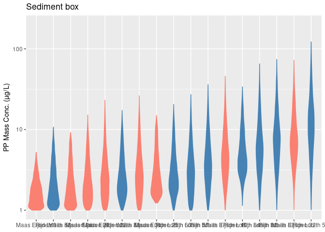
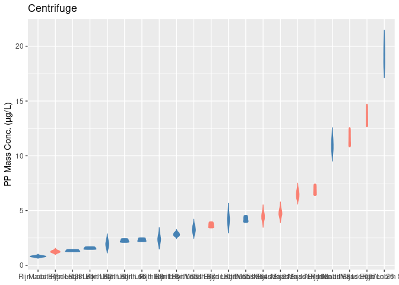
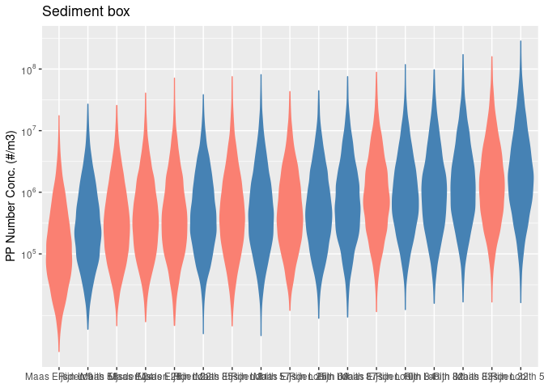
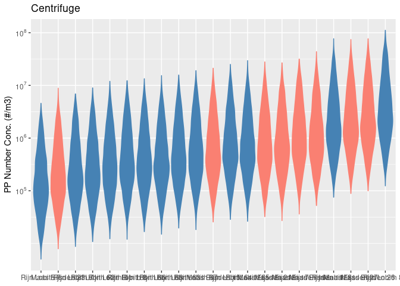

07_NumberFromMassConcentration
================
2026-07-07

Create figures folder if it does not yet exist

``` r
figures_dir <- paste0(project_dir, output_dir, "Figures/MassConversion")

if (!dir.exists(figures_dir)) {
  dir.create(figures_dir, recursive = TRUE)
}
```

Here we provide the code for converting measured SPM microplastics mass
concentrations to particle number concentrations as a proof of
principle. Details described in RIVM letter report 2026-0069.

For this we take the following steps:

1.  SPM microplastic concentrations (g/kg) is converted to water
    microplastics concentration (ug/L) using the SPM concentration.

2.  Per polymer we derive the volume of polymer (PP) measured using
    polymer density estimates.

3.  Using a predefined PSD, e.g. using the power law as derived using
    FTIR data to calculate the number of particles from the polymer
    volume.

# Data preparation

## Pyr-GCMS data

Data is prepared in [06_MassDataPrep.md](06_MassDataPrep.md). The
suspended matter polymer concentrations are converted to water
concentration using suspended matter concentration as measured in the
same period as the microplastic sampling. Additionally a correction for
microplastic particle recovery for the sediment box and centrifuge
approach is applied.

Below table illustrates an example of the dataset from Rijkswaterstaat.

| lab | Inweeg (mg) | Water_type    | Analysis_method | Sampling_method | Location_name | Data_source           | Sample_no | unit | Sampling_date_from | Sampling_date_to | SPM_mg_L_avg | SPM_mg_L_median | SPM_mg_L_min | SPM_mg_L_max | SPM_n | Recovery_min | Recovery_max | Polymer | Concentration_g_kg |
|:----|------------:|:--------------|:----------------|:----------------|:--------------|:----------------------|----------:|:-----|:-------------------|:-----------------|-------------:|----------------:|-------------:|-------------:|------:|-------------:|-------------:|:--------|-------------------:|
| RWS |      21.000 | Surface water | TED GC-MS       | centrifuge      | Maas Eijsden  | Freriks et al. (2025) |        11 | g/kg | 2023-11-13         | 2023-11-13       |    58.000000 |            58.0 |           58 |           58 |     1 |         0.86 |          1.0 | PP      |              0.110 |
| RWS |      18.980 | Surface water | TED GC-MS       | centrifuge      | Maas Eijsden  | Freriks et al. (2025) |        15 | g/kg | 2023-11-27         | 2023-11-27       |    38.000000 |            38.0 |           38 |           38 |     1 |         0.86 |          1.0 | PP      |              0.090 |
| RWS |      21.050 | Surface water | TED GC-MS       | centrifuge      | Maas Eijsden  | Freriks et al. (2025) |        16 | g/kg | 2023-10-31         | 2023-10-31       |    33.500000 |            33.5 |           31 |           36 |     2 |         0.86 |          1.0 | PP      |              0.180 |
| RWS |      19.950 | Surface water | TED GC-MS       | centrifuge      | Maas Eijsden  | Freriks et al. (2025) |        17 | g/kg | 2023-11-07         | 2023-11-07       |    37.000000 |            37.0 |           32 |           42 |     2 |         0.86 |          1.0 | PP      |              0.120 |
| RWS |      17.485 | Surface water | TED GC-MS       | sediment kist   | Maas Eijsden  | Freriks et al. (2025) |        28 | g/kg | 2023-09-05         | 2023-10-03       |     5.976471 |             5.0 |            5 |           13 |    34 |         0.10 |          0.9 | PP      |              0.125 |
| RWS |      20.060 | Surface water | TED GC-MS       | sediment kist   | Maas Eijsden  | Freriks et al. (2025) |        31 | g/kg | 2023-10-03         | 2023-10-31       |    10.129412 |             5.0 |            5 |           36 |    34 |         0.10 |          0.9 | PP      |              0.080 |

## Polymer density

Here only Polypropylene (PP) is considered further.

### Polypropylene

We assume a triangular distribution with 904 kg/m3 as most likely value
between 898 kg/m3 and 908 kg/m3 as min and max.

    ## # A tibble: 1 × 2
    ##   Polymer density_kg_m3$a    $b    $c $dist     
    ##   <chr>             <dbl> <dbl> <dbl> <chr>     
    ## 1 PP                  898   908   904 triangular

## Particle Size Distribution

Here a powerlaw is assumed to describe the PP particle size distribution
(PSD).

## Calculate using mean particle volume

We can calculate the total volume of microplastic particles (PP) by
dividing the measured mass concentration by the density:

$$V_{\text{total}} = \frac{m_{\text{PP}}}{\rho_{\text{PP}}}$$

We know that particle volume is distributed according a powerlaw with a
power law slope. We also know the smallest and largest particle in our
distribution. We can thus calculate the mean particle volume from the
powerlaw distribution:

$$\langle v \rangle = \frac{ \displaystyle \int_{v_{\min}}^{v_{\max}} v \, n(v) \, dv }{ \displaystyle \int_{v_{\min}}^{v_{\max}} n(v) \, dv }$$

$$\langle v \rangle = \frac{ \displaystyle \int_{v_{\min}}^{v_{\max}} v^{1-\alpha} \, dv }{ \displaystyle \int_{v_{\min}}^{v_{\max}} v^{-\alpha} \, dv }$$
Which is expressed as follows (the formula from (Koelmans et al. 2020)):

$$\langle v \rangle = \frac{1-\alpha}{2-\alpha}*\frac{V^{2-\alpha}_{UL}-V^{2-\alpha}_{LL}}{V^{1-\alpha}_{UL}-V^{1-\alpha}_{LL}}$$

where:

- $V = volume$
- $\langle v\rangle = mean \: volume$
- $\alpha= powerlaw \:slope$

The amount of particles in water (per Liter) is then given by dividing
the total volume of plastic by the mean volume:

$$N_{particles} = \frac{ V_{\text{total}} }{ \langle v \rangle } $$

``` r
# add alpha and upper and lower limit data

# Particle concentrations for the Rhine and Meuse were both only measured with LDIR. Therefore the LDIR alpha fits are read in below. 
AlphaData <- read_rds(paste0(project_dir, output_dir, "Data/resultsLDIR_pp2026-04-09.Rds")) 

FractionChange = 0.1

pyrGCMS_data <- 
  pyrGCMS_data |> 
  mutate(alpha_p2.5 = 
           AlphaData$Meuse$volume$alpha_conf_interval["2.5%"],
         alpha_avg = AlphaData$Meuse$volume$alpha,
         alpha_p97.5 = 
           AlphaData$Meuse$volume$alpha_conf_interval["97.5%"]) |> 
  mutate(
    MinimumSize_min = 1*(1-FractionChange),
    MinimumSize_top = 1,
    MinimumSize_max = 1*(1+FractionChange),
    MaximumSize_min = 5000*(1-FractionChange),
    MaximumSize_top = 5000,
    MaximumSize_max = 5000,
    widthFactor_min = 0.67*(1-FractionChange),
    widthFactor_top = 0.67,
    widthFactor_max = 1,
    heightFactor_min = 0.67*(1-FractionChange),
    heightFactor_top = 0.67,
    heightFactor_max = 1)

## Using particle shapes from Kooi and Koelmans
fvolmin <- function(l_min,widthFactor=0.67,heightFactor=0.67){
  Volume.ellipsoid(l_min,l_min*widthFactor,l_min*heightFactor)
  
  
  # See Kooi et al 2021 (SI)
  #For smaller particles is more a flat sphere
  # default width = 0.67*length
  # default height = 0.67*length

  
}

fvolmax <- function(l_max,widthFactor=0.67,heightFactor=0.67){
  Volume.ellipsoid(l_max,l_max*widthFactor,l_max*widthFactor*heightFactor)
  
  # larger particles are more ellipsoid
  # default width = 0.67 * length
  # default height = 0.67 * width
  
}

source("R/meanERM.R")

#Triangle_SPM_mg_L, Triangle_Recovery, Triangle_PolDensity, Triangle_l_min, Triangle_l_max, Triangle_widthFactor, Triangle_alpha
nRuns = 10000
pyrGCMS_data <-
  pyrGCMS_data |> 
  rowwise()|>
  mutate(
    UncertainVariables = list(
      tibble(
        Triangle_SPM_mg_L = triangle::rtriangle(
          n = nRuns,
          a = SPM_mg_L_min,
          b = SPM_mg_L_max,
          c = SPM_mg_L_median
        ),
        ## Note, this not a triangle distribution but uniform, We keep the name Triangle so the sensitivity analysis doesn't break
        Triangle_Recovery = runif( 
          n = nRuns,
          min = Recovery_min,
          max = Recovery_max
        ),
        Triangle_PolDensity = triangle::rtriangle(
          n = nRuns,
          a = density_kg_m3$a,
          b = density_kg_m3$b,
          c = density_kg_m3$c
        ),
        Triangle_l_min = triangle::rtriangle(
          n = nRuns,
          a = MinimumSize_min,
          b = MinimumSize_max,
          c = MinimumSize_top
        ),
        Triangle_l_max = triangle::rtriangle(
          n = nRuns,
          a = MaximumSize_min,
          b = MaximumSize_max,
          c = MaximumSize_top
        ),
        Triangle_widthFactor = triangle::rtriangle(
          n = nRuns,
          a = widthFactor_min,
          b = widthFactor_max,
          c = widthFactor_top
        ),
        Triangle_heightFactor = triangle::rtriangle(
          n = nRuns,
          a = heightFactor_min,
          b = heightFactor_max,
          c = heightFactor_top
        ),
        Triangle_alpha = triangle::rtriangle(
          n = nRuns,
          a = alpha_p2.5,
          b = alpha_p97.5,
          c = alpha_avg
        ),
        UncId = c(1:nRuns)
      ))
  ) |> 
  unnest(UncertainVariables) |> 
  mutate(PolConc_ug_L = 1e6*Concentration_g_kg*(Triangle_SPM_mg_L*1e-6)/Triangle_Recovery) |> 
  mutate(PolVolTot = (PolConc_ug_L/1e9) # 1e3 -> conversion g/L to kg/L
         / (Triangle_PolDensity)) |> 
  mutate(PartConc_L = 
           ((PolConc_ug_L/1e9) / # 1e9 -> conversion to kg/L
              (Triangle_PolDensity))/ # kg/m3
           F.Umeanx(Xul=fvolmax(l_max = Triangle_l_max,
                                widthFactor = Triangle_widthFactor,
                                heightFactor = Triangle_heightFactor)*1e-18,
                    Xll=fvolmin(l_min = Triangle_l_min,
                                widthFactor = Triangle_widthFactor,
                                heightFactor = Triangle_heightFactor)*1e-18,
                    Triangle_alpha)) # um3 -> m3
```

``` r
saveRDS(pyrGCMS_data, paste0(project_dir, output_dir, "Data/pyrGCMSdataRescaled_", Sys.Date(), ".Rds"))
```

# Figures Paragraph 3.3

``` r
library(ggplot2)
library(forcats) # Voor fct_reorder

ThemeRIVM <-   theme_minimal() +
  theme(
    axis.text.x = element_text(size = 22, angle = 45, hjust = 1),
      plot.title = element_text(size = 26),           
  plot.subtitle = element_text(size = 26),                       
  axis.title.x = element_text(size = 22),
  axis.title.y = element_text(size = 20),
  axis.text.y = element_text(size = 18),
  legend.text = element_text(size = 22),
  plot.margin = margin(t = 0.5, r = 0.5, b = 0.5, l = 2, unit = "cm")
  )
```

``` r
pyrGCMS_data |> pull(Polymer) |> unique()
```

    ## [1] "PP"

``` r
pyrGCMS_data |> pull(PolConc_ug_L) |> min()
```

    ## [1] 0.2270576

``` r
pyrGCMS_data |> pull(PolConc_ug_L) |> max()
```

    ## [1] 121.8571

``` r
SPMnumber <- pyrGCMS_data |> group_by(Location_name,Sample_no,Sampling_date_from,Sampling_date_to,Sampling_method) |> 
  summarise(SPM_n = mean(SPM_n),
            SPMConcMIN = min(Triangle_SPM_mg_L),
            SPMConcAVG = mean(Triangle_SPM_mg_L),
            SPMConcMAX =   max(Triangle_SPM_mg_L),
            PolConcMIN = min(PolConc_ug_L),
            PolConcAVG = mean(PolConc_ug_L),
            PolConcMAX =   max(PolConc_ug_L),
            n = n())

pMass_SK <- ggplot(pyrGCMS_data |> 
                           mutate(YaxisLabel = paste0(Location_name," ",Sample_no)) |> 
                           filter(Sampling_method == "sediment kist"),
                aes(x=fct_reorder(YaxisLabel, PolConc_ug_L), y = PolConc_ug_L,
                                 fill =  Location_name, colour = Location_name)) +
         geom_violin() +
  scale_color_manual(values = c("Rijn Lobith" = "steelblue", "Maas Eijsden" = "salmon"),
                     aesthetics = c("fill", "color"))+
  scale_y_log10(limits = c(1,200)) +
  labs(
      title = "Sediment box",
    y = "PP Mass Conc. (µg/L)",
    x = NULL
  ) + 
  # ThemeRIVM +
theme(legend.position = "none")

pMass_SK
```

<!-- -->

``` r
pMass_CF <- ggplot(pyrGCMS_data |> 
                           mutate(YaxisLabel = paste0(Location_name," ",Sample_no)) |> 
                           filter(Sampling_method == "centrifuge"),
                aes(x=fct_reorder(YaxisLabel, PolConc_ug_L), y = PolConc_ug_L,
                                 fill =  Location_name, colour = Location_name)) +
         geom_violin() +
  scale_color_manual(values = c("Rijn Lobith" = "steelblue", "Maas Eijsden" = "salmon"),
                     aesthetics = c("fill", "color"))+
  labs(
      title = "Centrifuge",
    y = "PP Mass Conc. (µg/L)",
    x = NULL
  ) + 
  # ThemeRIVM +
theme(legend.position = "none")

pMass_CF
```

<!-- -->

``` r
# gridExtra::grid.arrange(pMass_SK, pMass_CF,ncol=2)


pMassConverted_SK <- ggplot(pyrGCMS_data |> 
                           mutate(YaxisLabel = paste0(Location_name," ",Sample_no)) |> 
                           filter(Sampling_method == "sediment kist"), 
                         aes(y = PartConc_L*1000, 
                             x = fct_reorder(as.factor(YaxisLabel), PartConc_L),
                             fill =  Location_name, colour = Location_name)) +
  geom_violin() +
  scale_color_manual(values = c("Rijn Lobith" = "steelblue", "Maas Eijsden" = "salmon"),
                     aesthetics = c("fill", "color")) +
  scale_y_log10(limits = c(1E5,1E9)) +
  labs(
    title = "Sediment box",
    y = "PP Number Conc. (#/m3)",
    x = NULL
  ) + 
  #ThemeRIVM +
theme(legend.position = "none") +
   scale_y_log10(
    breaks = 10^(5:10),  
    labels = function(x) parse(text = paste0("10^", log10(x)))
  )

pMassConverted_SK
```

<!-- -->

``` r
pMassConverted_CF <- ggplot(pyrGCMS_data |> 
                           mutate(YaxisLabel = paste0(Location_name," ",Sample_no)) |> 
                           filter(Sampling_method == "centrifuge"), 
                          aes(y = PartConc_L*1000, 
                             x = fct_reorder(as.factor(YaxisLabel), PartConc_L),
                             fill =  Location_name, colour = Location_name)) +
  geom_violin() +
  scale_color_manual(values = c("Rijn Lobith" = "steelblue", "Maas Eijsden" = "salmon"),
                     aesthetics = c("fill", "color")) +
  scale_y_log10(limits = c(1E5,1E9)) +
  labs(
    title = "Centrifuge",
    y = "PP Number Conc. (#/m3)",
    x = NULL
  ) + 
  #ThemeRIVM +
theme(legend.position = "none")  +
   scale_y_log10(
    breaks = 10^(5:10),  # Alleen de machten van 10
    labels = function(x) parse(text = paste0("10^", log10(x)))
  )

pMassConverted_CF
```

<!-- -->

``` r
#gridExtra::grid.arrange(pMassConverted_SK, pMassConverted_CF,ncol=2)
```

``` r
# In a grid
ggsave(paste0(project_dir, output_dir,"Figures/MassConversion/massConcentration", Sys.Date(),".png"),
       gridExtra::grid.arrange(pMass_SK, pMass_CF,ncol=2), height = 7, width = 21, dpi = 400)
ggsave(paste0(project_dir, output_dir,"Figures/MassConversion/massConverted2Numbers", Sys.Date(),".png"),gridExtra::grid.arrange(pMassConverted_SK, pMassConverted_CF,ncol=2), height = 7, width = 21, dpi = 400)

# Separately

# Mass concentration
ggsave(paste0(project_dir, output_dir,"Figures/MassConversion/massConcentrationSedimentBox", Sys.Date(),".png"),
       pMass_SK, height = 7, width = 10, dpi = 400)
ggsave(paste0(project_dir, output_dir,"Figures/MassConversion/massConcentrationCentrifuge", Sys.Date(),".png"),
       pMass_CF, height = 7, width = 10, dpi = 400)

# Number concentration
ggsave(paste0(project_dir, output_dir,"Figures/MassConversion/massConverted2NumbersSedimentBox", Sys.Date(),".png"),pMassConverted_SK, height = 7, width =10, dpi = 400)
ggsave(paste0(project_dir, output_dir,"Figures/MassConversion/massConverted2NumbersCentrifuge", Sys.Date(),".png"),pMassConverted_CF, height = 7, width =10, dpi = 400)
```

## Table comparing GC-MS concentrations with FTIR/LDIR concentrations

``` r
PP_mass_data <- pyrGCMS_data |>
  mutate(River = case_when(
    Location_name == "Maas Eijsden" ~ "Meuse",
    Location_name == "Rijn Lobith" ~ "Rhine"
  )) |>
  group_by(Sample_no, River, Sampling_method) |>
  summarise(concentration = mean(PartConc_L)) |>
  mutate(concentration= concentration*1000) |>
  ungroup() |>
  group_by(River, Sampling_method) |>
summarise(
  min = format(min(concentration), scientific = TRUE, digits = 2),
  max = format(max(concentration), scientific = TRUE, digits = 2),
  mean = format(mean(concentration), scientific = TRUE, digits = 2)
) |>
  ungroup() |>
  mutate(min = as.character(min),
         mean = as.character(mean), 
         max = as.character(max),
         `Concentration (#/m3)` = paste0(mean, " (", min, "-", max, ")")) |>
  select(River, `Concentration (#/m3)`, Sampling_method) |>
  pivot_wider(
  names_from = Sampling_method, 
  values_from = `Concentration (#/m3)`
) |>
  select(River, `sediment kist`, centrifuge) |>
  rename(`Sediment box (#/m3)` = `sediment kist`,
         `Centrifuge (#/m3)` = centrifuge)
```

``` r
ConcAlphaRescaledUncertain_PP_L <-readRDS(paste0(project_dir, output_dir, "Data/Rescaled_concentrations_PP_2026-04-09.Rds"))

PP_averages_table <- ConcAlphaRescaledUncertain_PP_L |>
  filter(OptionType == "concentrationOption3") |>
  group_by(Sample_ID, River) |>
  summarise(concentration = mean(concentration)) |>
  ungroup() |>
  group_by(River) |>
summarise(
  min = format(min(concentration), scientific = TRUE, digits = 2),
  max = format(max(concentration), scientific = TRUE, digits = 2),
  mean = format(mean(concentration), scientific = TRUE, digits = 2)
) |>
  ungroup() |>
  mutate(min = as.character(min),
         mean = as.character(mean), 
         max = as.character(max),
         `Concentration (#/m3)` = paste0(mean, " (", min, "-", max, ")")) |>
  select(River, `Concentration (#/m3)`) |>
  rename(`Measured (#/m3)` = `Concentration (#/m3)`)

final_table = PP_mass_data |>
  left_join(PP_averages_table)
```

``` r
openxlsx::write.xlsx(final_table, file = paste0(project_dir, output_dir, "Tables/Number_and_mass_concentrations_PP.xlsx"))
```

# Sensitivity analysis

``` r
library(sensitivity)
library(readxl)
library(ggplot2)
library(ks) ### ks needed for sensiFdiv function

SampleNumber = 7 # change this to see how this is for different samples (see figures in section 4.1.2)

 probX <- pyrGCMS_data |> 
   filter(Sample_no == SampleNumber) |> 
   select(starts_with("Triangle")) 
      #Build Y vector from output
      probY <- pyrGCMS_data |> 
   filter(Sample_no == SampleNumber) |> 
        select("PartConc_L")
        
      probY[probY==0] <- 1e-20
      #logtransform data to avoid error
      probX = log(data.matrix(probX)+100)
      probY = log(data.matrix(probY))
      #remove constant columns
      probX1 <- probX[,apply(probX, 2, var, na.rm=TRUE)!= 0]
      #remove dependent variables
      
      #run global sensitivity analysis
      m <- sensiFdiv(model = NULL, X=probX1, fdiv = "TV", nboot = 0, conf = 0.95,   scale = TRUE)
      tell(m, y=probY,S)
```

    ## 
    ## Call:
    ## sensiFdiv(model = NULL, X = probX1, fdiv = "TV", nboot = 0, conf = 0.95,     scale = TRUE)
    ## 
    ## Model runs: 10000 
    ## 
    ## 
    ## 
    ## Csiszar f-divergence indices with TV 
    ##      original
    ## X1 0.04715257
    ## X2 0.04997534
    ## X3 0.03705562
    ## X4 0.05204220
    ## X5 0.06152164
    ## X6 0.07978510
    ## X7 0.07190987
    ## X8 0.83226398

``` r
      #prepare output for ggplot
      borg_d_temp <- data.frame(colnames(probX1),m$S$original)
      names(borg_d_temp)<-c("Factor", "delta")
      
      borg_d_temp |> 
      mutate(Factor = reorder(Factor, delta)) %>%
  ggplot(aes(x = Factor, y = delta)) +
  geom_col() +
  coord_flip() +  # makes it horizontal for better readability
  labs(title = paste0("Delta by Factor ",SampleNumber), x = "Factor", y = "Delta")
```

<!-- -->

<div id="refs" class="references csl-bib-body hanging-indent">

<div id="ref-koelmans2020" class="csl-entry">

Koelmans, A. A., P. E. Redondo-Hasselerharm, N. H. Mohamed Nor, and M.
Kooi. 2020. “Solving the Nonalignment of Methods and Approaches Used in
Microplastic Research to Consistently Characterize Risk.” *Environ Sci
Technol* 54 (19): 12307–15. <https://doi.org/10.1021/acs.est.0c02982>.

</div>

</div>
